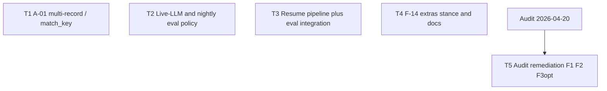

# Plan: Eval “Tackle now” (EVAL.md § Tackle now)

**Version:** 1.3 (T5 audit remediation landed) · **Scope:** Items **1 (A-01)**, **3 (live-LLM / nightly policy)**, **6 (A-04 resume + eval)**, **8 (A-03 / F-14 extras)** from `.dev/EVAL.md` (lines 4–11).

**Packets:** Self-contained executor prompts live under [`packets/`](./packets/) (`T1.md`–`T5.md`). This file summarizes and references them; it does not duplicate packet bodies.

**Changelog (plan meta):** v1.1 added completion summary, handoff status, and **Notes for auditor**. **v1.2** logs failed audit (`.dev/audits/2026-04-20-eval-tackle-now-2026-04.md`, verdict `fail`) and **amendment subtask T5** ([`packets/T5.md`](./packets/T5.md)) to close F1/F2/F3 — executor packets T1–T4 unchanged. **v1.3** records **T5 complete**: `.dev/EVAL.md` A-04 row aligned with `tests/test_eval_resume_integration.py`; README T2 policy pointer uses a markdown link; `tests/test_eval_runner.py` asserts pipeline eval passes `force_new_job=True` into `run_pipeline`.

---

## 1. Task statement

Hermes eval needs four coordinated closures from the Part A residual list: **(1)** stop silently relying on index order for multi-record goldens when no `match_key` is set (A-01), **(2)** define how non-mocked / live-LLM and nightly-style runs should interpret pass/fail under output variance (policy and, where agreed, machine-readable hooks), **(3)** prove the eval harness can score a job that was completed via `resume_pipeline` (A-04 integration gap), and **(4)** record the product stance and technical limits for “extra” / hallucinated fields when goldens are empty or schema-agnostic (F-14 / A-03) so future work is gated.

**Non-goals**

- Generic record matching algorithms (Hungarian, schema introspection) beyond existing `match_key` pairing — see `.dev/EVAL.md` “Explore generic matching (optional)”.
- Refactoring `scorer.py` for size alone (explicitly deferred in EVAL.md).
- Golden object-vs-array form (F-07) unless a separate plan is opened.
- Implementing F-14 “hallucination detection” as a product feature without explicit product approval.

---

## 2. Shared contracts

Binding for all subtasks. Downstream executors must not drift from these without a plan amendment.

| Topic | Binding |
|--------|---------|
| **Types / interfaces** | **Existing:** `EvalManifest.match_key` (`hermes/eval/manifest.py`), `_field_diffs_for_records(..., match_key)` (`hermes/eval/scorer.py`), `run_eval_suite(..., results_mode, job_id, ...)` (`hermes/eval/runner.py`), `run_pipeline(..., force_new_job=...)` / `resume_pipeline(job_id)` (`hermes/extraction/pipeline.py`). **T1:** If multi-record validation is tightened, failure is surfaced at manifest load / golden resolution with `ValueError` messages stable enough for tests to assert substrings (no error codes in HTTP sense — library / CLI). **T2:** Any **new** user-visible eval knobs (env vars, CLI flags, manifest keys, aggregation result shapes) must name owning subtask, land on a typed parse path (dataclass / Pydantic / Typer option), and have a construction or round-trip test — or be explicitly marked *deferred to a follow-up subtask ID* with no partial `getattr` defaults. **T3:** No new public API required; uses `ResultsMode.FROM_JOB` and existing DB helpers. **T4:** Prose-only unless product approves a new manifest flag; if a flag is added later, it becomes a new plan version. |
| **Error envelope** | Manifest and runner continue to raise `ValueError` for author-time mistakes; eval CLI maps `ValueError` to exit code 1 (`hermes/cli.py` `eval` command). No new HTTP or RPC contracts. |
| **Naming** | Prefer existing terms: `match_key`, `ResultsMode`, `FROM_JOB`, `force_new_job`. New symbols must be grep-unique under `hermes/eval/`. |
| **Logging** | Use module loggers (`hermes.eval.manifest`, `hermes.eval.scorer`, `hermes.eval.runner`); no new structured fields required unless T2 introduces aggregation metrics (then document field names in T2 packet §2). |
| **Tests** | `pytest`; tests colocated under `tests/` with `test_*.py`; match existing eval tests (`tests/test_eval_*.py`, `tests/test_pipeline_integration.py`). |
| **CLI surface** | **Frozen unless T2 explicitly extends:** `hermes eval` — `--fixture-dir`, `--manifest`, `--from-results`, `--from-jsonl`, `--update-goldens`, `--yes`, `--output`, `--model`, `--verbose` (`hermes/cli.py`). T3 must not require new flags. |

**Typed-surface binding note:** T2 “policy-only” milestone may ship **documentation only** (no new CLI flags). In that case §2 *Types* for new keys is N/A with rationale “no machine-readable aggregation in this plan version”; any later flag must satisfy the table in a plan amendment.

**CLI-as-contract:** Executors must grep `hermes/cli.py` for `eval_cli` before emitting downstream artifacts that reference flags.

---

## 3. Dependency DAG

- **Parallel groups (original):** `{T1, T2, T3, T4}` may execute in parallel — no hard edges.
- **Amendment:** **`AUD --> T5`** — T5 runs after audit report exists; it does not depend on re-executing T1–T4.
- **Soft dependencies:** T2 narrative may reference A-01 (order vs anchor) when explaining variance; coordinate wording if both touch README. T4 must not contradict T2 on pass/fail semantics. T5 touches `.dev/EVAL.md` and README; keep wording aligned with T2 decision log after F2 fix.

---

## 4. Subtask specs

### T1 — A-01: anchors when no natural key

| Field | Content |
|--------|---------|
| **ID** | T1 |
| **Scope** | Eliminate silent index-only pairing for **multi-record** goldens when `match_key` is unset, by validation and/or clear scorer notes, aligned with `resolve_golden_records` and `_field_diffs_for_records`. |
| **Files to touch** | `hermes/eval/manifest.py` (validation near `match_key_requires_anchor_in_goldens` / `load_manifest`), `hermes/eval/scorer.py` (optional `EvalSummary.notes` or chunk-level note when index pairing applies), eval README or `README.md` eval section if present, `tests/test_eval_manifest.py`, `tests/test_eval_scorer.py`. |
| **Contract bindings** | Full §2; no new CLI. |
| **Inputs** | None |
| **Outputs** | Stricter or warned manifest/golden combinations; tests proving reject/warn paths; author guidance. |
| **Kill criteria** | Ambiguity whether to **hard-fail** vs **warn-only** after listing all committed manifests under `tests/fixtures/eval/` — halt and report list + recommendation. |
| **Log tier** | `standard` |
| **Risks & mitigations** | Breaking existing fixtures: grep manifests + goldens for multi-record without `match_key`; migration = add `match_key` or split goldens. |

### T2 — Live-LLM / nightly eval policy

| Field | Content |
|--------|---------|
| **ID** | T2 |
| **Scope** | Define variance, tolerance bands, and multi-sample aggregation policy for non-mocked runs referencing `run_pipeline(..., force_new_job=True)` behavior and absence of an aggregation layer today. |
| **Files to touch** | `.dev/decision-logs/eval-tackle-now-T2-live-llm-policy.md` (decision log), optionally `.dev/EVAL.md` or project README pointer; optionally `hermes/eval/runner.py` / `cli.py` **only if** typed knobs are in scope — otherwise **documentation only**. |
| **Contract bindings** | Full §2; any new flag/env/key is architectural and must satisfy typed-surface rule. |
| **Inputs** | None |
| **Outputs** | Written policy + architectural decision log; optional implementation only if explicitly scoped with tests. |
| **Kill criteria** | Stakeholder pass/fail rules undefined (e.g. median vs worst-case) — halt after documenting options; do not invent numeric bands without owner. |
| **Log tier** | `architectural` |
| **Risks & mitigations** | Scope creep into building full experiment platform — cap at policy + minimal hooks or doc-only v1. |

### T3 — A-04: `resume_pipeline` + eval harness

| Field | Content |
|--------|---------|
| **ID** | T3 |
| **Scope** | Add an integration test that completes a job via `resume_pipeline` and then scores through `run_eval_suite` with `ResultsMode.FROM_JOB` (same job id), closing the gap that eval normally uses fresh jobs. |
| **Files to touch** | `tests/test_pipeline_integration.py` and/or new `tests/test_eval_resume_integration.py`; may reuse patterns from `test_resume_pipeline_finishes_remaining_chunks` and `tests/test_eval_regression.py`. |
| **Contract bindings** | Full §2; no new CLI flags. |
| **Inputs** | None |
| **Outputs** | Passing pytest; clear docstring explaining A-04 coverage. |
| **Kill criteria** | Cannot align mock LLM outputs with committed manifest goldens — halt and report whether to add a tiny dedicated fixture or use `score_manifest_with_results` with synthetic rows. |
| **Log tier** | `standard` |
| **Risks & mitigations** | Flaky real LLM — keep mocked like existing integration tests. |

### T4 — A-03 / F-14: extra hallucinated fields

| Field | Content |
|--------|---------|
| **ID** | T4 |
| **Scope** | Document by-design behavior (golden-keyed diff; empty golden limitations) and gate any scorer change on product approval. |
| **Files to touch** | `hermes/eval/scorer.py` module docstring or short comment pointer, `.dev/EVAL.md` row 8 cross-link, optional one test asserting current behavior is stable **if** a representative case exists. |
| **Contract bindings** | Full §2; no new CLI unless product approves detection feature (then re-plan). |
| **Inputs** | None |
| **Outputs** | Clear documentation; no behavioral change unless explicitly approved. |
| **Kill criteria** | Product requests detection but acceptance criteria unclear — halt with questions list. |
| **Log tier** | `trivial` to `standard` (upgrade to `standard` if a new manifest flag is introduced — prefer not in this plan). |
| **Risks & mitigations** | Confusion with `FieldMatch` `"extra"` in anchor mode — document distinction. |

---

## 5. Adversarial pass

1. **Rejected decompositions:** Merging T1 and T4 into one scorer change was rejected: F-14 is explicitly product-gated and by-design, while A-01 is an authoring safety issue — different stakeholders and kill criteria.

2. **Load-bearing assumptions:** (a) Committed eval fixtures under `tests/fixtures/eval/` remain the compatibility baseline for T1/T3. (b) `ResultsMode.FROM_JOB` correctly reflects post-resume DB state (same schema as fresh runs). (c) T2 can start documentation-only without blocking T1/T3.

3. **Highest re-plan risk:** **T2** — variance policy may force new aggregation surfaces or CI changes once stakeholders weigh in. **T3** is second — fixture/mock alignment can fail and require a dedicated minimal manifest.

4. **Hidden couplings:** T1 README edits and T2 policy may both touch the same README section — serialize doc merges or assign a single doc owner pass. T4 scorer docstring and T1 `EvalSummary.notes` could overlap — keep F-14 language about “extras” distinct from A-01 “ordering”.

---

## 6. Executor packets

| Packet | Path |
|--------|------|
| T1 | [packets/T1.md](./packets/T1.md) |
| T2 | [packets/T2.md](./packets/T2.md) |
| T3 | [packets/T3.md](./packets/T3.md) |
| T4 | [packets/T4.md](./packets/T4.md) |
| T5 | [packets/T5.md](./packets/T5.md) |

**Retired-string sweep:** After any amendment to CLI or manifest schema, re-grep all packets for stale flag names or `force_new_job` assumptions.

---

## 7. Amendment subtasks

### T5 — Audit remediation (2026-04-20)

**Trigger:** `.dev/audits/2026-04-20-eval-tackle-now-2026-04.md` verdict **`fail`** · **Blocker:** F1 (stale `.dev/EVAL.md` A-04 row vs landed `tests/test_eval_resume_integration.py`).

| Field | Content |
|--------|---------|
| **ID** | T5 |
| **Scope** | Close audit majors: **F1** (required), **F2** (required), **F3** (optional test for `force_new_job=True` on eval pipeline path). |
| **DAG** | `Audit 2026-04-20` → **T5** (see §3). No dependency from T5 back to T1–T4 code rewrites. |
| **Packet** | [`packets/T5.md`](./packets/T5.md) (self-contained executor prompt). |
| **DoD (narrative + code)** | **Landed:** `.dev/EVAL.md` row 6 no longer asserts “no integration test” for A-04; README decision-log markup fixed; optional F3 test or explicit deferral. **Plan back-annotation:** bump plan to **v1.3** or add “T5 complete” footnote under §8 when executor finishes; refresh §9 item 3 to state F1 remediated. **§2 alignment:** after merge, *Landed* bullet under §7 or changelog entry — `.dev/EVAL.md` “Tackle now” table must match repo (no intent drift vs plan §2). |

---

## 8. Completion summary (v1.1 execution; v1.2 audit gap; **v1.3 T5 remediation**)

Executors closed all four original subtasks (T1–T4). **Audit 2026-04-20** initially failed on **F1** (documentation traceability): `.dev/EVAL.md` row 6 was stale vs T3 — **remediation is T5**, not a reopen of T3 code. **T5 (v1.3)** closed **F1** (EVAL A-04 row cites integration test and `run_eval_suite` + `ResultsMode.FROM_JOB`), **F2** (README “How we measure quality” uses a markdown link to the T2 decision log), and **F3** (`test_runner_pipeline_mode_scores` asserts `force_new_job=True` on the mocked `run_pipeline` call).

**Landed artifacts (high level, T1–T4):**

- **T1 — A-01:** `load_manifest` rejects multiset file-backed goldens when `match_key` is unset (`multi_record_goldens_require_match_key`); runtime warning for in-memory multiset paths without anchor; committed fixture `sample_pdf_text_by_pages.manifest.yaml` updated with `match_key`; tests in `tests/test_eval_manifest.py` and `tests/test_eval_scorer.py`; README eval guidance updated.
- **T2 — Live-LLM policy:** Single architectural decision log — `.dev/decision-logs/eval-tackle-now-T2-live-llm-policy.md` — documents single-trial scoring, `force_new_job=True`, no in-repo aggregation, stakeholder options without selecting numeric bands, and explicit deferral of machine-readable knobs. Narrative cross-links in `.dev/EVAL.md`, `README.md`, and `CHANGELOG.md`.
- **T3 — A-04:** `tests/test_eval_resume_integration.py` — `resume_pipeline` then `run_eval_suite(..., ResultsMode.FROM_JOB)` against the same `job_id`, mocked LLM aligned to committed goldens.
- **T4 — F-14:** Module-level docstring on `hermes/eval/scorer.py` (extras vs `schema_pass_no_golden`, union-key diffs, anchor-only `FieldMatch` `"extra"`); `.dev/EVAL.md` row 8 reflects the stance.

**Verification:** `pytest` on `tests/test_eval_manifest.py`, `tests/test_eval_scorer.py`, and `tests/test_eval_resume_integration.py` passed at handoff (42 tests). Broader suite not re-run as part of this plan file.

**Decision logs:** Only **T2** required a decision log per log-tier rules in the orchestrator skill; T1/T3/T4 are covered by changelog, tests, and inline documentation.

---

## 9. Notes for auditor

Use this section as the primary briefing for an adversarial / post-execution review (e.g. auditor-review skill). It does not replace reading the diff and decision log.

1. **Single decision log is intentional.** Only subtask **T2** was **architectural** with a mandatory decision-log path. **T1** and **T3** were **standard**; **T4** was documentation-focused. Do **not** treat “one `.md` under `.dev/decision-logs/`” as incomplete unless your audit policy explicitly requires a log per subtask.

2. **Validate T2 kill criteria:** Confirm the decision log documents current harness behavior (`force_new_job=True`, no aggregation), names variance honestly, lists multi-sample **options** without **selecting** numeric tolerance or aggregation rules, and defers machine-readable knobs — matching §2 and the T2 packet.

3. **Traceability:** Cross-check §4 specs against `CHANGELOG.md` (top of `[schema 2.0] — 2026-04-17` block may bundle this work with older eval bullets — flag narrative clutter if merge hygiene matters). **F1 (2026-04-20 audit):** remediated by **T5** — `.dev/EVAL.md` row 6 cites `tests/test_eval_resume_integration.py` and describes `resume_pipeline` → `run_eval_suite` with `ResultsMode.FROM_JOB` (no “no integration test” claim).

4. **Construction-path caveat (A-01):** `multi_record_goldens_require_match_key` runs when `load_manifest` supplies `golden_base_dir` in Pydantic context. **`EvalManifest.model_validate(data)`** without that context does not perform the same checks — consistent with existing `match_key` anchor validation; flag only if the audit expects a stricter construction contract.

5. **F-14 scope:** No product-facing hallucination-detection feature shipped; docstring + EVAL row are the deliverable. Reject scope creep into new manifest flags without a new plan version.

6. **Repo hygiene:** Ensure `.dev/decision-logs/` (and this plan under `.dev/plans/` if policy requires) are **committed** so handoff is reproducible from git.

7. **Retired-string sweep:** If §2 or CLI lists in packets are ever amended, re-grep packets for stale `hermes eval` flags or outdated `force_new_job` claims; v1.1 plan does not re-emit packets.

8. **Post–T5:** Plan **v1.3** — F1/F2/F3 addressed; re-run audit if policy requires a fresh verdict after doc/test touch-ups.

---

## 10. Log — audit → amendment

| Date | Event |
|------|--------|
| 2026-04-20 | Plan v1.1 marked handoff-ready. |
| 2026-04-20 | Audit `.dev/audits/2026-04-20-eval-tackle-now-2026-04.md` returned **`fail`** (F1 major: `.dev/EVAL.md` A-04 row contradicts `tests/test_eval_resume_integration.py`; F2 minor README markup; F3 optional `force_new_job` test gap). |
| 2026-04-20 | Plan **v1.2**: amendment **T5** opened; packet [`packets/T5.md`](./packets/T5.md) emitted for executor remediation (no plan packet re-emission for T1–T4). |
| 2026-04-20 | Plan **v1.3**: **T5** executed — EVAL A-04 row, README T2 link, optional `force_new_job` regression assertion in `tests/test_eval_runner.py`. |
