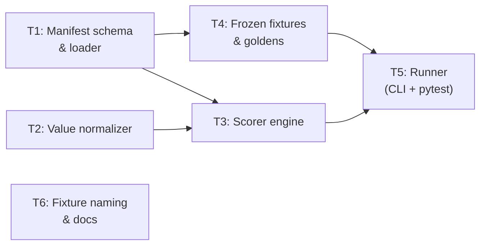
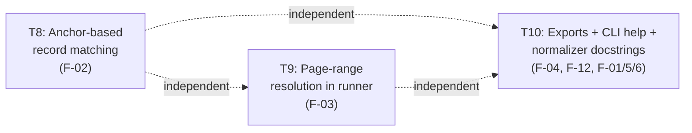

# Eval System — Orchestrator Plan

**Version:** 0.2.2 · **Status:** **Remediation complete — re-audit `pass` 2026-04-17** · **Source:** `.dev/evaluation-and-health-metrics-roadmap.md` Part A · **Audit:** `.dev/audits/2026-04-16-eval-part-a.md` (original) + §9 addendum (re-audit)

> **Reader's guide.** Sections 1–5 and the Appendix are the **v0.1 plan as executed** and are preserved verbatim for post-mortem diffability. **§Plan amendments** and **§v0.2 Remediation** below are new to v0.2 and describe the follow-up work triggered by the auditor's `fail` verdict on F-02 and F-03.

---

## 1. Task statement

Build a layered evaluation subsystem for Hermes that can measure extraction quality across schema-agnostic workloads. The system introduces: (a) a manifest format for tagging frozen fixtures with per-chunk expected outcomes, (b) a scorer that compares pipeline output against golden baselines using both structural (schema pass) and semantic (field-level) checks, (c) a runner invocable via `hermes eval` or `pytest`, and (d) the first set of committed golden fixtures with expected outputs.

The goal is to make quality regressions **visible and CI-blocking** without coupling to any single user schema or external eval vendor. The system should be self-contained — JSONL goldens, a Python scorer, and pytest — matching the "no vendor" path from the roadmap.

**Non-goals:**

- LLM-as-judge scoring (future layer; not part of this plan).
- Human review workflow or annotation UI.
- Integration with external eval platforms (LangSmith, Braintrust, etc.) — these remain documented as patterns.
- Part B of the roadmap (memory/throughput benchmarks, structlog, RSS sampling).
- Changes to the core extraction pipeline, validator, or repair logic.
- Synthetic data generation at scale (the `generate_test_datasets.py` large-file path is out of scope).

---

## 2. Shared contracts

### Types / interfaces

| Symbol | Location | Description |
|--------|----------|-------------|
| `EvalManifest` | `hermes/eval/manifest.py` | Pydantic model: fixture ref, schema ref, chunk-level labels (`positive` / `negative`), optional golden output path, metadata (modality, notes) |
| `ChunkLabel` | `hermes/eval/manifest.py` | Enum or literal: `positive`, `negative` |
| `ChunkExpectation` | `hermes/eval/manifest.py` | Per-chunk entry: `chunk_index` or `page_range`, `label: ChunkLabel`, `allow_empty: bool` (for negatives), optional `golden_path` |
| `EvalResult` | `hermes/eval/scorer.py` | Pydantic model: per-chunk and per-fixture scores, field-level diffs (when golden available), aggregate metrics |
| `FieldDiff` | `hermes/eval/scorer.py` | Per-field comparison result: field name, expected, actual, match type (`exact`, `normalized`, `mismatch`, `missing`) |
| `EvalSummary` | `hermes/eval/scorer.py` | Top-level report: positive pass rate, negative false-positive rate, field-level accuracy (when available), fixture metadata |

### Error envelope

Eval never raises exceptions into the pipeline — it operates post-hoc on already-completed job outputs. Errors are returned as structured data:

| Case | Behavior |
|------|----------|
| Manifest file not found or invalid | `EvalResult` with `error: str` set, zero scores, non-zero exit from CLI/pytest |
| Fixture file missing | Same — error string, skip fixture, summarize skips |
| Schema load failure | Same pattern |
| Golden parse failure | Flag in `FieldDiff` as `error`; do not crash scorer |

### Naming

| Kind | Convention |
|------|-----------|
| Module | `hermes/eval/` package: `manifest.py`, `scorer.py`, `runner.py`, `normalize.py` |
| Test files | `tests/test_eval_manifest.py`, `tests/test_eval_scorer.py`, `tests/test_eval_runner.py` |
| Fixtures dir | `tests/fixtures/eval/` — frozen input files + golden outputs |
| Manifest files | `tests/fixtures/eval/<fixture_name>.manifest.yaml` |
| Golden files | `tests/fixtures/eval/<fixture_name>.golden.jsonl` |
| CLI subcommand | `hermes eval` (Typer command in `cli.py`) |

### Logging

- Use stdlib `logging` (matches current codebase; structlog is a future Part B concern).
- Logger name: `hermes.eval.*` per module.
- Key structured fields in log messages: `fixture=`, `chunk_index=`, `label=`, `score=`.

### Tests

- Framework: **pytest** (existing).
- Location: `tests/test_eval_*.py`.
- Naming: `test_<module>_<behavior>`.
- Coverage expectation: all public functions in `hermes/eval/` have at least one positive and one negative test. Scorer normalization logic needs edge-case coverage.
- Fixtures: small inline or committed under `tests/fixtures/eval/`.

---

## 3. Dependency DAG



**Parallel groups:**

- `{T1, T2}` — independent; can run concurrently.
- `{T4}` — depends on T1 (needs manifest format) but can start skeleton work in parallel with T2.
- `{T3}` — depends on T1 and T2.
- `{T5}` — depends on T3 and T4.
- `{T6}` — can run in parallel with T5 (no code dependency) but benefits from T5 being done for accurate docs. Soft dependency.

**Soft dependencies:**

- T4 → T5 is strict (runner needs fixtures to produce meaningful results), but T5's code structure can be scaffolded alongside T3 before T4 is finalized.
- T6 → T5 is soft: docs can be written once the interface is stable, even if the runner isn't fully tested.

---

## 4. Subtask specs

### T1 — Manifest schema & loader

| Field | Content |
|-------|---------|
| **ID** | T1 |
| **Scope** | Define the `EvalManifest`, `ChunkLabel`, and `ChunkExpectation` Pydantic models. Implement a YAML loader that reads `.manifest.yaml` files and validates them. Support both chunk-index and page-range addressing. |
| **Files to touch** | `hermes/eval/__init__.py` (new package), `hermes/eval/manifest.py` (new), `tests/test_eval_manifest.py` (new) |
| **Contract bindings** | All shared contracts apply. `EvalManifest` is the most load-bearing type — T3, T4, T5 all consume it. |
| **Inputs** | None (root task) |
| **Outputs** | `hermes/eval/manifest.py` with models + `load_manifest(path) -> EvalManifest`, unit tests passing |
| **Kill criteria** | HALT if: (1) Pydantic v2 cannot represent the chunk-index-or-page-range union cleanly — escalate for design decision. (2) YAML parsing requires a new dependency not already in `pyproject.toml` — flag and decide (PyYAML is standard but must be explicitly added). |
| **Log tier** | standard |
| **Risks & mitigations** | **Risk:** Page-range vs chunk-index addressing may be ambiguous when chunking strategy changes between runs. **Mitigation:** Manifest stores the addressing mode explicitly; scorer resolves at eval time using the job's actual chunk map. Chunk-index is primary; page-range is a convenience alias resolved before scoring. |

#### Design decisions to capture

- **YAML vs JSON manifests:** YAML is friendlier for hand-authoring (comments, multi-line). JSON is zero-dep. Recommend YAML with PyYAML; fall back gracefully if missing. If adding PyYAML is rejected, switch to JSON — manifest schema stays the same.
- **`allow_empty` on negatives:** Defaults to `true` — a negative chunk producing zero records is correct behavior. If the user explicitly sets `allow_empty: false`, the scorer treats any output (including empty) on that chunk as a failure. This handles the roadmap's note about aligning with product rules.

---

### T2 — Value normalizer

| Field | Content |
|-------|---------|
| **ID** | T2 |
| **Scope** | Implement field-value normalization functions for comparison: lowercase + strip whitespace, numeric tolerance (absolute and relative), date normalization (parse to ISO then compare), optional currency-string cleaning. These are pure functions, no pipeline dependency. |
| **Files to touch** | `hermes/eval/normalize.py` (new), `tests/test_eval_normalize.py` (new) |
| **Contract bindings** | All shared contracts. `FieldDiff.match_type` values (`exact`, `normalized`, `mismatch`, `missing`) are consumed by the scorer. |
| **Inputs** | None (root task) |
| **Outputs** | `normalize.py` with: `normalize_string(v) -> str`, `numbers_close(a, b, rel_tol, abs_tol) -> bool`, `normalize_date(v) -> str | None`, `normalize_value(expected, actual, field_type_hint) -> MatchType`. Unit tests with edge cases (locale, whitespace, `$350,000.00` vs `350000.0`, `"5%"` vs `0.05`). |
| **Kill criteria** | HALT if: (1) Numeric tolerance logic cannot be defined without knowing the schema field type at eval time — escalate; the normalizer may need access to JSON Schema field metadata. (2) Date parsing requires `dateutil` or heavy dependency — flag; decide whether to keep stdlib-only or add it. |
| **Log tier** | standard |
| **Risks & mitigations** | **Risk:** Over-normalizing can mask real regressions (e.g., `"Toyota"` vs `"TOYOTA"` might matter for some schemas). **Mitigation:** Normalizer is configurable per-field via type hints in the manifest or golden file. Default is lenient (lowercase, strip); strict mode available. The scorer reports *which* normalization was applied in `FieldDiff` so regressions in formatting are still visible. |

#### Tradeoffs

| Choice | Upside | Downside |
|--------|--------|----------|
| **Lenient default** (lowercase, strip, numeric tolerance) | Fewer false negatives in eval | May hide formatting regressions |
| **Strict default** (byte equality) | Catches all changes | Brittle; every locale/format difference is noise |
| **Per-field config in manifest** | Precise control | More authoring burden per fixture |

Recommendation: lenient default, per-field override as a future refinement. Track normalization applied in `FieldDiff` for auditability.

---

### T3 — Scorer engine

| Field | Content |
|-------|---------|
| **ID** | T3 |
| **Scope** | Core scoring logic. Given a manifest, a completed Hermes job (extraction results from DB or exported JSONL), and optional golden outputs, produce an `EvalResult` with: (1) per-chunk pass/fail against label expectations, (2) field-level diffs when goldens are present, (3) aggregate `EvalSummary`. |
| **Files to touch** | `hermes/eval/scorer.py` (new), `tests/test_eval_scorer.py` (new) |
| **Contract bindings** | All shared contracts. Consumes `EvalManifest` (T1), normalization functions (T2), reads `extraction_results` / exported JSONL. Produces `EvalResult`, `FieldDiff`, `EvalSummary`. |
| **Inputs** | T1 (manifest models), T2 (normalizer) |
| **Outputs** | `scorer.py` with `score_fixture(manifest, job_results, goldens?) -> EvalResult`. Tests covering: positive chunk with matching golden, positive chunk with mismatched golden, negative chunk with no output (pass), negative chunk with hallucinated output (fail), missing chunk in results. |
| **Kill criteria** | HALT if: (1) `extraction_results.record_json` format is not stable enough to parse reliably outside the pipeline — investigate and document the contract. (2) Scoring a "positive with no golden" case has no meaningful metric beyond schema-pass — this is a known gap; document it but don't block. (3) The scorer needs to re-run the pipeline (it should never do this — it only reads existing results). |
| **Log tier** | architectural |
| **Risks & mitigations** | **Risk:** `record_json` in `extraction_results` is a JSON string of `model_dump(mode="json")` arrays — the scorer must parse this identically. **Mitigation:** Use the same `json.loads` path; add a shared utility if needed. **Risk:** Field-level comparison requires knowing field names from the schema — schema-agnostic scoring means the scorer must introspect the golden file's keys, not hardcode them. **Mitigation:** Golden JSONL records define the field superset; scorer iterates golden keys and checks actual. |

#### Scoring rules (to implement)

| Chunk label | Has golden? | Output present? | Output validates? | Score |
|-------------|-------------|-----------------|-------------------|-------|
| positive | yes | yes | yes | Field-level diff against golden |
| positive | yes | yes | no | `schema_reject` — fail |
| positive | yes | no | — | `missing_output` — fail |
| positive | no | yes | yes | `schema_pass` — pass (no field accuracy) |
| positive | no | no | — | `missing_output` — fail |
| negative | — | no | — | `correct_abstention` — pass |
| negative | — | yes (empty array) | — | pass if `allow_empty` (default) |
| negative | — | yes (non-empty) | — | `false_positive` — fail |

#### Decision: how to read job results

Two options for how the scorer accesses extraction results:

1. **Direct DB read** — query `extraction_results` by `job_id`. Tight coupling to DB schema but zero friction.
2. **JSONL export** — use existing `hermes export --format jsonl` output. Decoupled but requires the export to be run first.

Recommendation: support both. Primary path is DB read (it's already there via `db.py`). Accept a `--from-jsonl <path>` override for CI or external use. The scorer function signature takes `list[dict]` — the caller (runner) handles sourcing.

---

### T4 — Frozen fixtures & goldens

| Field | Content |
|-------|---------|
| **ID** | T4 |
| **Scope** | Commit 2–3 frozen evaluation fixtures under `tests/fixtures/eval/` with manifests and golden JSONL. Use the existing `sample.xlsx` and `sample_text.pdf` fixtures (already generated by `tests/generate_fixtures.py`) as the base. Author manifests with chunk labels and hand-verified golden outputs. |
| **Files to touch** | `tests/fixtures/eval/sample_excel.manifest.yaml` (new), `tests/fixtures/eval/sample_excel.golden.jsonl` (new), `tests/fixtures/eval/sample_pdf_text.manifest.yaml` (new), `tests/fixtures/eval/sample_pdf_text.golden.jsonl` (new), `tests/generate_fixtures.py` (extend to optionally copy/symlink eval fixtures or document that they're static) |
| **Contract bindings** | Manifests must conform to `EvalManifest` (T1). Goldens must be parseable by scorer (T3). Schema refs must match existing example schemas (`hermes.schemas.examples.vehicle_fleet:VehicleRecord`). |
| **Inputs** | T1 (manifest format to author against) |
| **Outputs** | Committed fixture files, one manifest + golden per fixture. Each manifest has at least one `positive` and ideally one `negative` chunk (or a note explaining why not — the current small fixtures may be all-positive). |
| **Kill criteria** | HALT if: (1) The existing `sample.xlsx` / `sample_text.pdf` fixtures are not deterministic enough for golden comparison (e.g., PDF text extraction varies by `pymupdf` version) — test on CI first; pin library version or use text-normalized comparison. (2) The `VehicleRecord` schema doesn't cover all fields in the fixture data — extend the fixture or the schema, but document which. |
| **Log tier** | standard |
| **Risks & mitigations** | **Risk:** Golden files become stale when prompt or normalization changes improve output. **Mitigation:** The runner (T5) supports `--update-goldens` to regenerate; goldens are committed, so diffs are visible in PRs. **Risk:** Small fixtures don't represent real user documents (noted in roadmap tradeoffs). **Mitigation:** This is v1 — real-world fixtures are a future addition. The manifest format supports any fixture. |

#### Open question: negative chunks

The current fixtures (`sample.xlsx` with 5 vehicle rows, `sample_text.pdf` with 3 vehicles across 2 pages) are all positive content. Options for negative chunks:

1. **Add a "boilerplate-only" page** to `sample_text.pdf` (e.g., a terms & conditions page with no vehicle data) via `generate_fixtures.py`.
2. **Create a small separate fixture** (`tests/fixtures/eval/boilerplate_only.pdf`) that is entirely negative.
3. **Defer negative-chunk testing** to a later fixture and document the gap.

Recommendation: option 1 — extend `generate_fixtures.py` to add a third page of boilerplate to `sample_text.pdf`. Lowest friction, tests the abstention path. If modifying the existing fixture is too disruptive to other tests, use option 2.

---

### T5 — Runner (CLI + pytest)

| Field | Content |
|-------|---------|
| **ID** | T5 |
| **Scope** | Implement the eval runner: (1) a `hermes eval` CLI command that runs the pipeline on manifest fixtures, scores results, and prints a summary table; (2) a pytest entry (`tests/test_eval_regression.py`) that asserts no regressions against committed goldens. Support `--update-goldens` for refreshing baselines. Emit optional JSON export of eval results. |
| **Files to touch** | `hermes/eval/runner.py` (new), `hermes/cli.py` (add `eval` command), `tests/test_eval_regression.py` (new), `tests/test_eval_runner.py` (new, unit tests for runner logic) |
| **Contract bindings** | All shared contracts. Runner orchestrates: load manifest (T1) → run pipeline or load existing results → score (T3) → format output. Does **not** re-implement scoring logic. |
| **Inputs** | T3 (scorer), T4 (fixtures to run against) |
| **Outputs** | Working `hermes eval` command, pytest regression suite, optional `--output eval_results.json` export. |
| **Kill criteria** | HALT if: (1) Running the pipeline inside eval requires an LLM API key — this means eval in CI needs either a mock or a pre-computed results cache. Decide mock strategy before implementing. (2) `hermes eval` wants to import from `hermes.extraction.pipeline` but circular dependencies arise — restructure imports. (3) The `--update-goldens` flow would silently overwrite goldens without user confirmation — add a safety prompt or `--yes` flag. |
| **Log tier** | architectural |
| **Risks & mitigations** | **Risk:** Eval requires live LLM calls, making it expensive and non-deterministic in CI. **Mitigation:** Two modes: (a) `hermes eval` runs the full pipeline (for local use, nightly CI with API key), (b) `hermes eval --from-results <job_id>` scores an existing job's results (cheap, deterministic). pytest regression tests use mode (b) with pre-committed fixture results or mocked LLM (same mock pattern as `test_pipeline_integration.py`). **Risk:** `--update-goldens` makes it too easy to paper over regressions. **Mitigation:** Require explicit flag; CI should **never** run with `--update-goldens`. |

#### CLI interface sketch

```
hermes eval [OPTIONS]

Options:
  --fixture-dir PATH     Directory with manifests + goldens (default: tests/fixtures/eval/)
  --manifest PATH        Run a single manifest instead of all in fixture-dir
  --from-results JOB_ID  Score an existing job's results instead of re-running pipeline
  --from-jsonl PATH      Score from exported JSONL file
  --update-goldens       Overwrite golden files with current output (requires --yes or interactive confirm)
  --yes                  Skip confirmation for --update-goldens
  --output PATH          Write eval results JSON to file
  --model TEXT           Override LLM model for pipeline runs
  --verbose              Detailed per-field output
```

#### pytest integration

`tests/test_eval_regression.py` would:

1. Load each manifest in `tests/fixtures/eval/`.
2. Run pipeline with mocked LLM (returning the golden output — i.e., the test validates the scorer and manifest, not the LLM).
3. Assert `EvalSummary.positive_pass_rate == 1.0` and `EvalSummary.false_positive_rate == 0.0`.
4. If goldens present, assert field-level accuracy == 1.0.

This ensures the eval *infrastructure* doesn't regress, not that the LLM produces perfect output (that's for `hermes eval` with a live model).

---

### T6 — Fixture naming alignment & docs

| Field | Content |
|-------|---------|
| **ID** | T6 |
| **Scope** | Address the roadmap item: `test_excel_accuracy_synthetic.xlsx` implies accuracy testing; rename or add real accuracy metrics. Write a short "How we measure quality" section for the README pointing to this plan and the eval subsystem. |
| **Files to touch** | `generate_test_datasets.py` (rename references if renaming files), `README.md` (add eval section), `.dev/evaluation-and-health-metrics-roadmap.md` (mark completed items) |
| **Contract bindings** | Naming conventions from shared contracts. No code interfaces — docs and file naming only. |
| **Inputs** | T5 (to document accurate CLI usage) — soft dependency |
| **Outputs** | Updated README with eval section, renamed or annotated test datasets, roadmap items checked off. |
| **Kill criteria** | HALT if: renaming `test_excel_accuracy_synthetic.xlsx` breaks the `hermes test` CLI command — check `cli.py` references first. |
| **Log tier** | trivial |
| **Risks & mitigations** | **Risk:** Renaming files breaks the `hermes test` command for users who already have the files generated. **Mitigation:** Update `cli.py` to use the new name, add a deprecation note, or keep both names with a fallback. Prefer renaming to `test_excel_stress_synthetic.xlsx` to match intent (stress/integration, not accuracy). |

---

## 5. Adversarial pass

### 1. Rejected decompositions

**Alternative A — Scorer-first, manifest-later:** Build the scorer with inline golden definitions (no manifest files), then add manifests as a second pass. Rejected because the manifest is the load-bearing contract: without it, the scorer has no way to distinguish positive from negative chunks, and T4/T5 would need rework. Starting with the manifest also forces early decisions about addressing (chunk-index vs page-range) that affect everything downstream.

**Alternative B — Single monolith subtask (manifest + scorer + runner):** Fewer subtasks, less coordination overhead. Rejected because the scorer and normalizer have distinct test surfaces and the scorer is the highest-complexity component. Merging them increases blast radius of design changes and makes parallel work harder.

**Alternative C — External eval tool (Braintrust / Langfuse adapter):** The roadmap lists these as patterns. Rejected for v1 because it introduces vendor coupling, requires network access for eval, and doesn't align with the "no vendor" path explicitly preferred in the roadmap. The manifest + scorer design is compatible with future adapters if needed.

### 2. Load-bearing assumptions

1. **`extraction_results.record_json` is a stable, parseable JSON array of `model_dump(mode="json")` dicts.** If this format changes without the scorer being updated, all golden comparisons break. Mitigated by T3 reading through the same `json.loads` path and testing against real DB output.

2. **Existing test fixtures (`sample.xlsx`, `sample_text.pdf`) are deterministic across environments.** If `pymupdf` or `openpyxl` versions produce different normalization output, golden baselines won't match. Mitigated by pinning library versions in `pyproject.toml` and using normalized comparison.

3. **PyYAML (or a YAML parser) can be added as a dependency.** If the project has a strict zero-new-deps policy, the manifest format must switch to JSON. The models are the same either way.

4. **The chunking algorithm is stable.** If `chunk_pages` changes behavior, chunk indices in manifests become invalid. Mitigated by the manifest's page-range fallback and by documenting that golden updates are expected after chunking changes.

### 3. Highest re-plan risk

**T4 (Frozen fixtures & goldens)** — authoring correct golden outputs requires running the pipeline with a real LLM, verifying the output by hand, and committing it. If the current fixtures are too simple to exercise interesting scorer behavior (e.g., no negative chunks, no field-level mismatches), the eval system will pass trivially but not catch real regressions. This is the subtask most likely to surface "we need better fixtures" which forces re-scoping.

### 4. Hidden couplings

- **T1 ↔ T4:** The manifest format is defined in T1, but the specific field values (chunk indices, page ranges) depend on how the fixtures are structured in T4. If T4 discovers that the fixtures need a different addressing scheme, T1's models must change. Mitigated by T1 supporting both chunk-index and page-range from the start.

- **T3 ↔ pipeline internals:** The scorer reads `extraction_results` from the DB. If `_process_chunk` in `pipeline.py` changes how `record_json` is serialized (e.g., wrapping in metadata), the scorer breaks. Mitigated by documenting the `record_json` contract in T3's tests.

- **T5 (runner) ↔ T5 (pytest):** Both are in T5 but serve different audiences (CLI users vs CI). The pytest path needs mocked LLM responses while the CLI path needs real ones. If the mock strategy isn't cleanly separated, changes to one break the other. Mitigated by the runner accepting pre-computed results (`--from-results`) so pytest never needs a live LLM.

---

---

## Plan amendments (post-v0.1)

This section closes audit finding **F-09** by retroactively listing adjustments made during v0.1 execution that were not captured in §1 Non-goals or §2 Shared contracts at plan time. Each entry points at the authoritative artifact.

### A-1 — T7: Abstention / false-positive remediation (discovered during T4/T5)

**Trigger.** After T4 added a boilerplate page to `sample_text.pdf` to create a negative chunk, `hermes eval` did not score it as `correct_abstention`. Investigation traced the coupling to the validator: `parse_json_array` coerced `{}` and all-null dicts into `[{spurious}]`, which defeated the negative rule. The scoring pathway depended on validator behavior that had not been captured as a contract.

**Artifact.** `.dev/eval/T7-abstention-decision-log.md` (authoritative rationale, alternatives, assumptions, deferred items).

**Files edited (previously listed as non-goals in §1).**

- `hermes/extraction/pipeline.py` — `_process_chunk` persists empty validated arrays; `validation_passed=is_last and not result.error`.
- `hermes/extraction/validator.py` — `{}` and all-null dict coercion to `[]`; `_drop_all_null_validated` filter.
- `hermes/extraction/prompts.py` — abstention instructions in `SYSTEM_PROMPT` + `USER_PROMPT_TEMPLATE`.
- `hermes/schemas/examples/vehicle_fleet.py` — `numero_serie: str` (required).

**Implicit behavioral contracts now depended on by eval (captured retroactively):**

| Contract | Semantics |
|----------|-----------|
| `extraction_results.record_json == "[]"` is a legitimate success state (not a missing result). |
| `llm_runs.validation_passed == True` for empty validated arrays (last-attempt + no error). |
| `parse_json_array({}) == []` and `parse_json_array([{all null}]) == []`. |
| `vehicle_fleet.VehicleRecord.numero_serie` is required (bundled copy only; user-installed copies may diverge until `hermes init --refresh`). |

These are read by T3 (scorer) and are load-bearing for the v0.2 remediation tasks below.

### A-2 — Non-goals amended

§1's non-goals listed "changes to the core extraction pipeline, validator, or repair logic." Under A-1, four files in that scope were modified. The non-goal now reads (as of v0.2):

> Changes to the core extraction pipeline, validator, or repair logic **except as required to make the eval system measure what it claims to measure; any such change must be captured as a decision log and listed under §Plan amendments.**

---

## v0.2 Remediation

### R1. Task statement

Close the two **major** audit findings that block merge (F-02, F-03) and the three **optional** code-level follow-ups the auditor recommended (F-04, F-12, F-01/F-05/F-06 documentation). The deliverable is unchanged from v0.1: a schema-agnostic eval subsystem whose promises hold end-to-end. v0.2 adjusts the scorer, the runner, and the package surface to match those promises; it does not add new scoring modes or new fixture types.

**Non-goals (v0.2):**

- New fixture content, new schemas, new CLI modes beyond help-text tweaks.
- LLM-as-judge, external eval vendor adapters (still deferred from v0.1).
- F-07 (golden read/write asymmetry) — observation-tier; out of scope for this bump.
- F-14 (extra-hallucinated-field detection on positive chunks) — falls out as a side-effect of T8 if we choose to surface it; not the primary deliverable.
- Rewriting or widening any v0.1 contract except the additive deltas in §R2.

### R2. Shared contracts (delta from v0.1 §2)

All v0.1 contracts remain in force. The additions below apply to every v0.2 subtask.

| Topic | v0.2 addition |
|-------|---------------|
| **Types** | `EvalManifest.match_key: str \| None = None` (new, optional). When set, scorer pairs expected vs. actual records by this field instead of by list index. |
| **Types** | `FieldMatch` widens to `MatchType \| Literal["error", "extra"]`. `"extra"` is emitted for actual records with no golden counterpart under anchor-based matching. `MatchType` itself (in `normalize.py`) is **unchanged**. |
| **Types** | `score_fixture` signature gains an optional `chunk_page_map: Mapping[int, tuple[int, int]] \| None = None` — inclusive (start, end) page range per `chunk_index`. When provided and an expectation uses `page_range`, the scorer resolves it to `chunk_index` before scoring. When absent, page-range expectations continue to emit `page_range_unresolved` (v0.1 behavior preserved for callers that don't know page layout). |
| **Runner** | `job_results_from_db_rows` must include `source_pages` per row (already persisted in `extraction_results`). Runner derives `chunk_page_map` from these rows and passes it to `score_fixture`. |
| **Package exports** | `hermes/eval/__init__.py` additionally exports `EvalResult`, `FieldDiff`, `FieldMatch`, `ChunkScore`, `ChunkReason`, `EvalSummary`. (Matches the contract the v0.1 plan already stated in §2 but the `__init__` did not implement — F-04.) |
| **CLI** | `hermes eval --help` must surface that `--from-results` and `--from-jsonl` require `--manifest`. Runtime error remains the source of truth; help text mirrors it. |
| **Naming** | v0.2 subtask IDs: `T8`, `T9`, `T10`. (v0.1's T7 is already claimed by the abstention decision log; no renumbering.) |
| **Tests** | Each v0.2 subtask adds tests to the existing `tests/test_eval_*.py` files (no new test files). Coverage expectation: every new contract branch has ≥1 positive and ≥1 negative test. |
| **Backwards compat** | v0.1 manifests without `match_key` must score identically to their v0.1 results. Regression guard: the existing `tests/test_eval_regression.py` suite must pass unchanged. |

### R3. Dependency DAG (v0.2)



**Parallel groups:** `{T8, T9, T10}` — all independent. No shared files; no shared contract surface beyond the §R2 deltas, which are additive.

**Soft merge hazards (see §R5.4):**

- T8 and T9 both touch `hermes/eval/scorer.py` (T8: record pairing; T9: optional `chunk_page_map` parameter). Different functions in the same file; merge conflict is textual, not semantic. Executor who lands second rebases.
- T8 and T10 both touch `hermes/eval/__init__.py` (T8: potentially re-exports a new type if `match_key` ever gets a dedicated alias; T10: exports all v0.1 types). T10 should land last for simplicity, but either order is correct.

### R4. Subtask specs

#### T8 — Anchor-based record matching (closes F-02)

| Field | Content |
|-------|---------|
| **ID** | T8 |
| **Scope** | Replace index-based pairing in `_field_diffs_for_records` with anchor-based pairing when `EvalManifest.match_key` is set. Add `match_key` to the manifest schema as an optional top-level field. Emit `FieldDiff(match="missing")` for golden records with no actual counterpart and `FieldDiff(match="extra")` for actual records with no golden counterpart. Preserve v0.1 behavior exactly when `match_key` is `None` (default). Update existing fixtures' manifests to set `match_key: numero_serie` (the schema's required anchor) so the regression suite exercises the new path. |
| **Files to touch** | `hermes/eval/manifest.py` (add `match_key` field + validator that errors if set but any golden record is missing it), `hermes/eval/scorer.py` (pairing logic in `_field_diffs_for_records` + extend `FieldMatch` with `"extra"`), `tests/test_eval_manifest.py` (field load + validation), `tests/test_eval_scorer.py` (reorder-invariant matching, missing records, extra records, duplicate anchor values, absent-anchor-in-row), `tests/fixtures/eval/sample_excel.manifest.yaml` + `tests/fixtures/eval/sample_pdf_text.manifest.yaml` (add `match_key: numero_serie`). |
| **Contract bindings** | All shared contracts from v0.1 §2 **and** v0.2 §R2. Specifically: the `FieldMatch` extension and `match_key` field are load-bearing. |
| **Inputs** | None (independent of T9/T10). Reads the v0.1 scorer/manifest as starting point. |
| **Outputs** | Updated manifest model with `match_key`; scorer that pairs by anchor when set; fixture manifests using `match_key`; test cases (see §Kill criteria for the four mandatory scenarios); decision log (tier = architectural). |
| **Kill criteria** | HALT and report if: (1) The chosen anchor field (`numero_serie`) is not present on all records in an existing golden file — escalate; the fixture may need a different anchor or a `match_key_fallback` contract. (2) Anchor-based matching would require schema introspection (importing the Pydantic model from `schema_ref`) rather than just reading golden keys — this widens the scorer's coupling surface; escalate. (3) Duplicate anchor values exist within a single golden record list — decide policy (first-wins + warn, or error) before proceeding. (4) Backwards-compat test (existing `test_eval_regression.py`) fails under any code path where `match_key is None`. |
| **Log tier** | architectural |
| **Risks & mitigations** | **Risk:** A live LLM omits the anchor field for some records; those rows can't be paired. **Mitigation:** rows missing the anchor land in the "extra" bucket (reported as FieldDiff with match="extra"), counted as mismatches in the aggregate; this is strictly better than silently failing on order. **Risk:** Multiple records share the same anchor value (the field isn't really unique). **Mitigation:** first-wins pairing + warning log; second+ duplicates land as "extra." Decision log must capture this choice. **Risk:** `match_key` optional means tests pass trivially on v0.1 manifests. **Mitigation:** the T8 deliverable includes flipping both v0.1 fixture manifests to use `match_key: numero_serie`, so the regression suite actually exercises the anchor path going forward. |

**Design decisions to capture (decision log required):**

- Policy for duplicate anchor values (recommend first-wins + warn). **Landed** (T8 decision log §1): *multiset FIFO pairing* per anchor (one `WARNING` per duplicate value with `fixture=/chunk_index=/match_key=/duplicate_value=` fields). FIFO is a specific first-wins policy; re-audit 2026-04-17 §9.4 classified the narrative gap as "documented override."
- Policy for rows missing the anchor on the *actual* side (recommend: treat as unpaired → "extra" bucket). **Landed** (T8 decision log §2): as recommended.
- Policy for rows missing the anchor on the *golden* side (recommend: error at manifest-load validator — golden authors are responsible). **Landed** (T8 decision log §3): as recommended, via `validate_match_key_in_golden_files` invoked from the `match_key_requires_anchor_in_goldens` model validator (requires `golden_base_dir` in validation context — see §R10 E-2).
- Whether to report matched-pair count in `EvalSummary` (recommend yes: new field `records_matched`, `records_extra`, `records_missing`; required for the aggregate to tell a coherent story post-T8). **Landed** (T8 decision log §4): as recommended.

#### T9 — Page-range resolution in runner (closes F-03)

| Field | Content |
|-------|---------|
| **ID** | T9 |
| **Scope** | Implement page-range → chunk-index resolution so manifests using `addressing: page_range` can run end-to-end. The scorer gains an optional `chunk_page_map: Mapping[int, tuple[int, int]] \| None` parameter (see §R2). The runner builds this map from each job row's `source_pages` (already stored in `extraction_results`) and passes it to `score_fixture`. A `page_range` expectation resolves to the single chunk whose page set **exactly covers** the requested range; ambiguous (multiple candidates) or unresolvable (zero candidates) ranges continue to emit `page_range_unresolved` (v0.1 behavior) with a more specific reason string. Add an end-to-end test using a page-range manifest variant. |
| **Files to touch** | `hermes/eval/scorer.py` (accept `chunk_page_map`, new resolution helper `_resolve_page_range_to_chunk_index`, extend `ChunkReason` literals with `"page_range_ambiguous"`), `hermes/eval/runner.py` (derive map in `job_results_from_db_rows` — or in a new `build_chunk_page_map(job_results) -> dict[int, tuple[int, int]]` helper; pass through `score_manifest_with_results`), `hermes/eval/__init__.py` (no change from T9 alone; T10 handles exports), `tests/test_eval_scorer.py` (page-range resolution success; ambiguous; unresolved), `tests/test_eval_runner.py` (page-range manifest, DB mode, JSONL mode), `tests/fixtures/eval/sample_pdf_text_by_pages.manifest.yaml` (new sibling manifest using `addressing: page_range` against the existing PDF fixture — no new PDF needed). |
| **Contract bindings** | v0.1 §2 + v0.2 §R2. Critical: `score_fixture` signature gains an optional kwarg; callers that don't pass it see identical v0.1 behavior. `source_pages` is parsed as a comma-separated list of 1-based page integers per `hermes/db.py:305` and `hermes/extraction/pipeline.py:991`. |
| **Inputs** | None (independent of T8/T10). Reads `extraction_results.source_pages` — an **implicit behavioral contract** already listed under §Plan amendments A-1. |
| **Outputs** | Working page-range manifest path; new sibling manifest fixture; tests covering resolution success, ambiguity, unresolvable; decision log (tier = architectural — new scoring contract parameter + new failure mode). |
| **Kill criteria** | HALT and report if: (1) `source_pages` is empty or absent for some job rows (possible on a partially-failed run) — decide whether to treat as "cannot resolve" or fail loudly. Recommend: rows with empty `source_pages` are omitted from `chunk_page_map`; the corresponding expectations surface `page_range_unresolved`. (2) No existing fixture has >1 chunk, making the new manifest pointless — escalate; may need to raise `MAX_CHUNK_TOKENS` down for the fixture or author a third fixture (out of scope per §R1). (3) Resolution policy "exact coverage" proves too strict for real fixtures (e.g., a `page_range: 1–3` that actually lands inside a chunk spanning pages 1–5) — decide before coding whether to support "contained-in" resolution and what reason string to emit. (4) The page-range manifest fixture's resolved chunk_index is not deterministic across chunker tuning changes (already-flagged dependency in §5.2 #4) — accept the coupling or reject `addressing: page_range` at manifest-load time. |
| **Log tier** | architectural |
| **Risks & mitigations** | **Risk:** The chunker's behavior changes (merge thresholds, window size) and a previously-resolvable range becomes ambiguous. **Mitigation:** the runner's reason string distinguishes `page_range_ambiguous` (multiple matching chunks) from `page_range_unresolved` (zero or no map); CI failure message tells the maintainer which side of the coupling broke. **Risk:** `from_jsonl` mode omits `source_pages` (not required today). **Mitigation:** the JSONL loader in `load_job_results_from_jsonl` should pass `source_pages` through when present and tolerate its absence; if absent, map is incomplete and resolution fails gracefully with the same `page_range_unresolved` reason. **Risk:** Adding the new fixture manifest ties the `eval_outcomes_ok` CI signal to chunker determinism. **Mitigation:** the new manifest uses "contained-in" resolution (if adopted per kill-criterion #3) against a page range large enough to survive chunker-tuning noise. |

**Design decisions to capture (decision log required):**

- Resolution policy: exact-coverage vs. contained-in (recommend contained-in: a `page_range: 2–3` resolves to any chunk whose `source_pages` is a subset of or equal to `{2, 3}`; if no such chunk exists, fall back to the chunk whose `source_pages` fully contains `{2, 3}` — but only if exactly one).
- Whether to rewrite the expectation's `chunk_index` in-place or resolve lazily per call. Recommend: the scorer resolves lazily via `chunk_page_map` and never mutates the manifest (keeps `EvalManifest` immutable as a Pydantic model; keeps resolution re-entrant for retries).
- Whether `addressing: page_range` manifests without a `chunk_page_map` should error at scorer-entry or continue to emit the soft `page_range_unresolved` failure. Recommend: keep soft behavior (v0.1 compat); the runner is responsible for providing the map.

#### T10 — Exports + CLI help + normalizer docstrings (closes F-04, F-12, F-01/F-05/F-06 documentation)

| Field | Content |
|-------|---------|
| **ID** | T10 |
| **Scope** | Three small, related polish items bundled into one trivial-tier task. (a) Extend `hermes/eval/__init__.py` to export `EvalResult`, `FieldDiff`, `FieldMatch`, `ChunkScore`, `ChunkReason`, `EvalSummary` (contracted in v0.1 §2, never exported — F-04). (b) Update `hermes eval` CLI help text so `--from-results` and `--from-jsonl` explicitly note "requires --manifest" (F-12). (c) Add docstring warnings to `normalize.py` covering the three known ambiguity classes the auditor surfaced (bare int vs. `"N%"` — F-01; US/EU date ambiguity — F-05; `abs_tol=0.0` near-zero behavior — F-06) and recommend explicit `field_type_hint` usage in the `normalize_value` docstring. **No behavior changes in normalize.py** — v0.2 documents the existing behavior; any code fix lands in a future task if the owner decides the current behavior is wrong. |
| **Files to touch** | `hermes/eval/__init__.py` (add exports), `hermes/cli.py` (help text for the `eval` Typer command — locate the options in the existing `eval` subcommand, roughly `cli.py` lines 660–836), `hermes/eval/normalize.py` (docstring additions only), `README.md` ("How we measure quality" section — add a one-line note pointing at `field_type_hint` as the recommended escape hatch for ambiguous fields), `CHANGELOG.md` (one bullet under the 2026-04-17 entry the v0.2 executor creates). No test changes required; the trivial tier means the executor may add a single smoke test for the new `__init__` exports if it feels warranted. |
| **Contract bindings** | v0.1 §2 + v0.2 §R2 (specifically: the exports list matches §R2's "Package exports" row). |
| **Inputs** | None. **Soft dependency on T8:** if T8 adds `FieldMatch = ... \| "extra"` and/or introduces `records_matched`/`records_extra`/`records_missing` on `EvalSummary`, T10 re-exports should include those. If T10 lands before T8, T8's executor appends the new type to the `__all__` list. |
| **Outputs** | Updated exports, updated help text, updated docstrings, one-line README addition, one changelog bullet. No decision log (trivial tier). |
| **Kill criteria** | HALT and report if: (1) Adding an export creates a circular import (unlikely; flagged for safety). (2) The CLI help text can't be updated without restructuring the Typer command (Typer options carry their own `help=`; should be a one-line change per option). (3) The README's "How we measure quality" section has already been rewritten by an unrelated PR and the guidance no longer fits — escalate; do not rewrite the section wholesale in a trivial-tier task. |
| **Log tier** | trivial |
| **Risks & mitigations** | **Risk:** The normalizer docstring warnings drift from the actual behavior if T8 or a future task changes normalize.py. **Mitigation:** add a one-line comment at the top of each warning block saying "verified against `tests/test_eval_normalize.py::<test_name>`" so future edits know what to re-verify. **Risk:** Export additions break `from hermes.eval import *` semantics for downstream code. **Mitigation:** this package currently uses explicit `__all__`; appending to `__all__` is additive and safe. |

### R5. Adversarial pass (v0.2)

#### R5.1 — Rejected alternatives

**Alternative A — "Document-away" F-02 by restricting `hermes eval` to mocked self-replay.** Rejected. The roadmap explicitly called for a CLI path against live LLMs ("local use, nightly CI with API key") and the v0.1 T5 packet implemented `ResultsMode.PIPELINE` against a live model. Walking that back would leave Part B's health-metrics work with no working baseline measurement path. Better to fix the pairing.

**Alternative B — Implement F-02 via Hungarian / best-fit matching rather than anchor-based.** Rejected for v0.2. Hungarian is correct for arbitrary similarity matrices but requires a per-field similarity score (not a binary match) and is O(n³) in record count. Anchor-based matching is O(n) with a clear semantic story ("the schema's required field is the record's identity"). Hungarian is a fallback if T8's kill criteria fire and an anchor can't be assumed.

**Alternative C — Implement F-03 by rejecting `addressing: page_range` at manifest-load time with a clear "not yet supported" error.** Rejected. Audit §7 listed this as option (b); the chunker already stores `source_pages` and the runner already reads from the DB — the resolution work is ~30 lines. Shipping the feature costs less than the documentation overhead of "supported-in-theory-but-not-in-practice."

**Alternative D — Bundle T8, T9, T10 into a single remediation subtask.** Rejected. T8 and T9 each have distinct contract surfaces, distinct kill criteria, and distinct decision-log-worthy policy choices. Bundling collapses the audit trail and increases blast radius. The three subtasks run in parallel, so the ceremony cost of separate specs is near zero.

#### R5.2 — Load-bearing assumptions

1. **`extraction_results.source_pages` format is `"1,2,3"` (comma-separated 1-based page integers).** Verified at `hermes/db.py:305` and `hermes/extraction/pipeline.py:991`. If this format changes, T9's resolver breaks. Mitigated by T9's test reading from real pipeline output, not a hand-crafted string.

2. **`numero_serie` is a reliable anchor for the `VehicleRecord` schema's goldens.** Verified by A-1 — it was made required during T7. If a future schema has no natural anchor, T8's `match_key` is optional and those manifests fall back to v0.1 index behavior.

3. **v0.1 manifests have `match_key: null` (or unset) and continue to score identically after T8 lands.** This is the backwards-compat promise. The existing `tests/test_eval_regression.py` is the contract test; it must pass unchanged.

4. **The chunker's behavior is stable across the v0.2 window.** Already flagged in v0.1 §5.2 #4; T9's new page-range fixture makes this coupling stricter. If the chunker is retuned during v0.2 execution, the fixture's resolved `chunk_index` may drift. Mitigation: T9's decision log must capture the chunker-tuning assumption and recommend using the "contained-in" resolution policy to tolerate small drifts.

5. **The `EvalSummary` schema can grow fields (`records_matched`, etc.) without breaking consumers.** The only in-tree consumers are `outcomes_to_json_blob` (which uses `model_dump(mode="json")`) and the CLI table printer. Adding fields to a Pydantic `BaseModel` is additive; old JSON consumers ignore unknown keys.

#### R5.3 — Highest re-plan risk

**T8** — the `match_key` contract needs to handle four edge cases (kill criteria #1–#4). If any escalates, the solution shape changes: Hungarian fallback, schema introspection for the anchor, or shrinking scope to "document F-02 only." Among these, "duplicate anchor values in goldens" is the most likely real-world surprise — the current golden for `sample_excel.golden.jsonl` has five vehicles; if two share a `numero_serie` (either by authoring bug or by fixture design), T8's first-wins policy needs a decision-log entry and a warning log, not a silent pick.

**Sanity check.** T9 is higher up-front but has a clearer kill path (resolution policy decision) and doesn't touch the data model. T10 is trivial; re-plan risk is near zero.

#### R5.4 — Hidden couplings

- **T8 × T10 → `__init__.py` exports.** If T8 adds `"extra"` to `FieldMatch` but T10 lands first with a frozen `__all__`, T8's executor must append to `__all__`. Not a real conflict, just a merge ordering note.

- **T9 × v0.1 T3 decision log.** The v0.1 T3 log said "runner should pre-resolve page_range." T9 implements that, but instead of mutating the manifest, passes a `chunk_page_map` to the scorer. The decision log for T9 must explicitly supersede that line of the T3 log (decision-log chain integrity).

- **T8 × T3 positional pairing in existing tests.** `tests/test_eval_scorer.py::test_eval_scorer_positive_matching_golden` and friends use one record, so positional vs. anchor pairing look identical. T8 must add **multi-record** tests with **shuffled order** to prove the new behavior; existing tests continue to pass but no longer prove F-02 is fixed. This is the kind of coverage-gap-on-test-change that is easy to miss; T8's kill criterion #4 plus explicit "add reorder-invariant test" output item guard against it.

- **T9 × the v0.1 regression suite.** `tests/test_eval_regression.py` replays goldens with a mocked LLM that returns a single list verbatim. Mocked-LLM output has no `source_pages` of its own; the runner's DB read still populates `source_pages` from the real pipeline execution under mocked LLM calls. T9's new page-range fixture will exercise this path; T9's test must verify that the mocked pipeline still populates `source_pages` correctly (it should, since the mock is applied at the LLM layer, not the chunker layer — but this assumption is worth an explicit assertion in the test).

- **T8 × live-LLM abstention (v0.1 A-1).** Anchor-based matching relies on the actual side having the anchor populated. If the LLM legitimately abstains (empty array) on a positive chunk, T8 still reports all golden rows as "missing" — which is correct (it *is* a failure) but the failure mode changes from v0.1's `missing_output` to `field_mismatch` with N `missing` diffs. Decision log should call out this reason-code shift so the CLI output reader isn't surprised.

### R6. Log tier assignments (v0.2)

| Subtask | Tier | Rationale |
|---------|------|-----------|
| T8 | architectural | New contract (`match_key`), new `FieldMatch` value, new aggregate metrics, multiple real policy choices. Decision log required. |
| T9 | architectural | New scorer parameter, new failure mode (`page_range_ambiguous`), resolution policy choice. Decision log required. |
| T10 | trivial | Additive exports + docstring/help-text edits. Changelog bullet only. |

### R7. Validation checklist (per orchestrator-planning §Validation)

- [x] Every subtask has all required fields; no TBD in kill criteria or contract bindings.
- [x] DAG has no cycles, no orphan nodes (all three subtasks are roots; explicitly flagged as independent).
- [x] Parallel safety: T8, T9, T10 are independent except for the additive `__init__.py` / `scorer.py` merge hazards captured in §R5.4. No shared contract surface is concurrently modified.
- [x] Adversarial pass has ≥1 rejected alternative (four) and ≥1 load-bearing assumption (five).
- [x] Log tiers match scope (two architectural, one trivial; no inflation).
- [x] Packets emitted to `.dev/eval/T8-packet.md`, `.dev/eval/T9-packet.md`, `.dev/eval/T10-packet.md`; each is self-contained.

### R8. Re-planning triggers specific to v0.2

Re-enter planning (v0.3 bump) if:

- T8's kill criterion #1 (anchor missing in goldens) or #2 (schema-introspection required) fires.
- T9's kill criterion #3 (exact-coverage too strict) fires **and** contained-in also fails on the existing fixtures.
- The audit's major findings F-02 or F-03 remain reproducible after the v0.2 executors declare completion (i.e., the remediation didn't remediate).
- A new audit identifies a contract violation in the `match_key` branch that wasn't captured in T8's decision log.

### R9. Executor packets

Self-contained per §R7:

- `.dev/eval/T8-packet.md` — anchor-based record matching (F-02)
- `.dev/eval/T9-packet.md` — page-range resolution in runner (F-03)
- `.dev/eval/T10-packet.md` — exports + CLI help + normalizer docstrings (F-04, F-12, F-01/F-05/F-06 documentation)

Each packet embeds §1 (task statement + Plan amendments), §R2 (contract delta), its own §R4 block, filtered §R5.2/§R5.4 entries referencing that subtask, and resolves Inputs as "none" or "runtime artifact" per §R4.

### R10. Post-T8 contract emissions (addendum 2026-04-17)

T8 executed cleanly — no kill criteria fired, regression suite unchanged, duplicate-anchor policy and schema-introspection-avoidance both held (see `.dev/eval/T8-decision-log.md`). T8 emitted three implementation-level contracts that v0.2 §R2 did not specify; they are now binding on T9 and T10 to prevent divergence.

| E | Contract emitted by T8 | Authority | Binding on |
|---|------------------------|-----------|------------|
| E-1 | **`golden_base_dir` resolution policy.** `hermes.eval.manifest.infer_golden_base_dir(manifest_path)` walks up from the manifest file looking for `pyproject.toml` (12 levels max), falling back to the manifest's parent directory. `load_manifest` uses this to build the validation context. The runner's `resolve_golden_base_dir(manifest_path, project_root)` returns `project_root`; in-tree, these converge because `project_root` is the repo root (`pyproject.toml` location). | `hermes/eval/manifest.py:20–31`, `hermes/eval/manifest.py:233–247`, `hermes/eval/runner.py:52–55` | T9 (new page-range fixture + tests), T10 (if any smoke test constructs a manifest) |
| E-2 | **Direct `EvalManifest(...)` construction fails when `match_key` is set.** Callers must use either `load_manifest(path)` **or** `EvalManifest.model_validate(data, context={"golden_base_dir": Path(...)})`. The model validator `match_key_requires_anchor_in_goldens` reads `info.context["golden_base_dir"]` and raises `ValueError("golden_base_dir is required in validation context when match_key is set")` if absent. | `hermes/eval/manifest.py:107–121` | T9 test code (any test constructing a manifest with `match_key`); T10 smoke test (if added) |
| E-3 | **Reason-code refinement under anchor mode.** An LLM returning `[]` on a positive chunk with N golden rows emits `reason=field_mismatch` + N `FieldDiff(match="missing")` entries (anchor mode) instead of v0.1's coarse `reason=missing_output`. Strictly more informative; not a regression. v0.1 manifests (`match_key=None`) continue to emit `missing_output` unchanged. Documented in `T8-decision-log.md` §Items deferred. | `hermes/eval/scorer.py` (post-T8), `T8-decision-log.md` | T10 README / normalizer docstring (note the informative failure mode for anchor-mode users) |

**Why not v0.3:** None of E-1/E-2/E-3 violate v0.2 §R2. E-1 and E-2 fill in detail the plan left implicit (manifest path resolution, Pydantic construction ergonomics). E-3 is the exact behavior called out in T8-packet §5 ("reason-code shift" coupling note) and in v0.2 §R5.4; the decision log captured it as deferred guidance, not deferred work. No re-plan triggers fired.

### R11. Closure & residual observations (post-re-audit 2026-04-17)

**Remediation status: closed.** The re-audit addendum to `.dev/audits/2026-04-16-eval-part-a.md` §9 returned verdict `pass`:

- **F-02** (record ordering) — closed by T8.
- **F-03** (`page_range` dead code) — closed by T9.
- **F-04** (missing exports), **F-12** (CLI help) — closed by T10.
- **F-09** (T7 plan amendment gap) — closed by §Plan amendments A-1/A-2 in this plan.
- **F-01, F-05, F-06** — documented per T10, not behavior-changed, per v0.2 §R1 non-goals. Intentional.
- **F-10** — retracted in original audit; no action.

**Residual observations (non-blocking, tracked for future work):**

| ID | From | Description | Disposition |
|----|------|-------------|-------------|
| A-01 | re-audit §9.7 | Manifests without `match_key` + multi-record goldens are still positional/order-sensitive (v0.1 path). | Mitigated by all committed fixtures setting `match_key: numero_serie`; README documents the knob. **Future work only** if a real fixture emerges where no natural anchor exists. |
| A-02 | re-audit §9.7 (was F-07) | Golden read/write asymmetry (`apply_golden_updates` writes JSON arrays; reader accepts objects). | Out of scope per v0.2 §R1. Revisit if a user authors object-form goldens and round-trip flips them. |
| A-03 | re-audit §9.7 (was F-14) | Scorer cannot detect "extra hallucinated fields" on positive chunks when the golden record is empty (schema-agnostic iteration uses golden keys). | Out of scope per v0.2 §R1; intentional per T3 risk note. |
| A-04 | re-audit §9.7 (was original C9) | `resume_pipeline` + eval path is not directly integration-tested. | Known gap from v0.1 audit; transitively covered but no dedicated test. **Future work** if resume semantics change. |

**Accepted narrative override (re-audit §9.4):** Plan §R4 T8 originally recommended "first-wins + warn"; the landed policy is multiset FIFO pairing (a specific first-wins variant) per T8 decision log §1. The design-decisions bullet in §R4 T8 is now annotated with the landed policy so the narrative and decision log match.

**Cross-task clarification (re-audit §9.4):** The "T4 WARN-string vs EventName" pattern belongs to **Part B** observability/bench work (`bench.dualsink.regression` at WARN level vs `EventName` union). Part A eval uses stdlib logging per §2 and does not consume `EventName`. No cross-plan contract conflict.

**Re-plan posture.** No v0.3 bump warranted. No triggers fired on the re-audit path:

- Kill criteria: none fired on T8, T9, or T10.
- Silent contract extension: none — all deviations are either in decision logs (T8 FIFO, T9 supersession of T3) or in §R10 (T8 emissions).
- Highest-risk subtask surprise: T8's duplicate-anchor path was the §R5.3 risk; it landed per decision log with WARN signaling.
- Cross-subtask test failure: none; 74 eval-focused tests pass.

**Further work on eval lands in a new plan**, not a version bump of this one. Candidates (owner's call): A-01 schema-anchor inference, A-02 golden round-trip symmetry, A-03 extra-field detection, A-04 resume coverage.

---

## Appendix: Roadmap item mapping

How the queued items from the roadmap map to subtasks:

| Roadmap item | Subtask |
|-------------|---------|
| Stratified eval manifest | T1 |
| Scorer rules for negatives | T3 |
| Golden outputs | T4 |
| `hermes eval` or `pytest` entry | T5 |
| Align naming | T6 |
| Optional export | T5 (`--output`) |
| Docs | T6 |

---

## Changelog

- **0.2.2 (2026-04-17):** **Closure bump.** Re-audit addendum to `.dev/audits/2026-04-16-eval-part-a.md` §9 returned verdict `pass`. Added §R11 "Closure & residual observations" recording F-02/F-03/F-04/F-12 as closed, F-01/F-05/F-06 as intentionally documented-only, and four non-blocking residuals (A-01 through A-04) tracked for future work. Annotated §R4 T8 design-decisions bullets with the landed policies (multiset FIFO, manifest-load validation for missing golden anchor, `EvalSummary` aggregate additions) so the plan narrative matches T8 decision log. Status header now reads "Remediation complete." No code changes.
- **0.2.1 (2026-04-17):** Addendum — added §R10 "Post-T8 contract emissions" (E-1 `golden_base_dir` resolution policy via `infer_golden_base_dir`; E-2 `EvalManifest(...)` direct construction requires validation context when `match_key` is set; E-3 reason-code refinement under anchor mode). No subtask changes. Source: T8 executor upstream feedback; binding on T9 and T10.
- **0.2 (2026-04-17):** Remediation bump in response to `.dev/audits/2026-04-16-eval-part-a.md` verdict `fail`. Adds §Plan amendments (closes F-09 by recording T7 retroactively and listing the implicit behavioral contracts eval depends on) and §v0.2 Remediation (three new subtasks: T8 anchor-based record matching for F-02, T9 page-range resolution in runner for F-03, T10 exports + CLI help + normalizer docstrings for F-04 + F-12 + F-01/F-05/F-06 documentation). v0.1 §1–§5 preserved verbatim for post-mortem diffability. F-07 and F-14 explicitly out of scope for this bump.
- **0.1 (2026-04-16):** Initial plan from Part A of evaluation roadmap.
