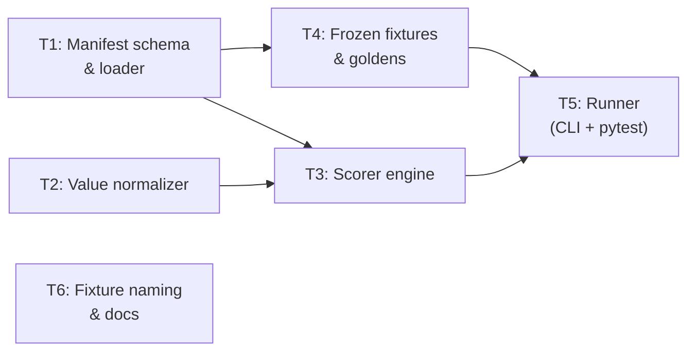

# Eval System — Orchestrator Plan

**Version:** 0.1 · **Status:** Draft · **Source:** `.dev/evaluation-and-health-metrics-roadmap.md` Part A

---

## 1. Task statement

Build a layered evaluation subsystem for Hermes that can measure extraction quality across schema-agnostic workloads. The system introduces: (a) a manifest format for tagging frozen fixtures with per-chunk expected outcomes, (b) a scorer that compares pipeline output against golden baselines using both structural (schema pass) and semantic (field-level) checks, (c) a runner invocable via `hermes eval` or `pytest`, and (d) the first set of committed golden fixtures with expected outputs.

The goal is to make quality regressions **visible and CI-blocking** without coupling to any single user schema or external eval vendor. The system should be self-contained — JSONL goldens, a Python scorer, and pytest — matching the "no vendor" path from the roadmap.

**Non-goals:**

- LLM-as-judge scoring (future layer; not part of this plan).
- Human review workflow or annotation UI.
- Integration with external eval platforms (LangSmith, Braintrust, etc.) — these remain documented as patterns.
- Part B of the roadmap (memory/throughput benchmarks, structlog, RSS sampling).
- Changes to the core extraction pipeline, validator, or repair logic.
- Synthetic data generation at scale (the `generate_test_datasets.py` large-file path is out of scope).

---

## 2. Shared contracts

### Types / interfaces

| Symbol | Location | Description |
|--------|----------|-------------|
| `EvalManifest` | `hermes/eval/manifest.py` | Pydantic model: fixture ref, schema ref, chunk-level labels (`positive` / `negative`), optional golden output path, metadata (modality, notes) |
| `ChunkLabel` | `hermes/eval/manifest.py` | Enum or literal: `positive`, `negative` |
| `ChunkExpectation` | `hermes/eval/manifest.py` | Per-chunk entry: `chunk_index` or `page_range`, `label: ChunkLabel`, `allow_empty: bool` (for negatives), optional `golden_path` |
| `EvalResult` | `hermes/eval/scorer.py` | Pydantic model: per-chunk and per-fixture scores, field-level diffs (when golden available), aggregate metrics |
| `FieldDiff` | `hermes/eval/scorer.py` | Per-field comparison result: field name, expected, actual, match type (`exact`, `normalized`, `mismatch`, `missing`) |
| `EvalSummary` | `hermes/eval/scorer.py` | Top-level report: positive pass rate, negative false-positive rate, field-level accuracy (when available), fixture metadata |

### Error envelope

Eval never raises exceptions into the pipeline — it operates post-hoc on already-completed job outputs. Errors are returned as structured data:

| Case | Behavior |
|------|----------|
| Manifest file not found or invalid | `EvalResult` with `error: str` set, zero scores, non-zero exit from CLI/pytest |
| Fixture file missing | Same — error string, skip fixture, summarize skips |
| Schema load failure | Same pattern |
| Golden parse failure | Flag in `FieldDiff` as `error`; do not crash scorer |

### Naming

| Kind | Convention |
|------|-----------|
| Module | `hermes/eval/` package: `manifest.py`, `scorer.py`, `runner.py`, `normalize.py` |
| Test files | `tests/test_eval_manifest.py`, `tests/test_eval_scorer.py`, `tests/test_eval_runner.py` |
| Fixtures dir | `tests/fixtures/eval/` — frozen input files + golden outputs |
| Manifest files | `tests/fixtures/eval/<fixture_name>.manifest.yaml` |
| Golden files | `tests/fixtures/eval/<fixture_name>.golden.jsonl` |
| CLI subcommand | `hermes eval` (Typer command in `cli.py`) |

### Logging

- Use stdlib `logging` (matches current codebase; structlog is a future Part B concern).
- Logger name: `hermes.eval.*` per module.
- Key structured fields in log messages: `fixture=`, `chunk_index=`, `label=`, `score=`.

### Tests

- Framework: **pytest** (existing).
- Location: `tests/test_eval_*.py`.
- Naming: `test_<module>_<behavior>`.
- Coverage expectation: all public functions in `hermes/eval/` have at least one positive and one negative test. Scorer normalization logic needs edge-case coverage.
- Fixtures: small inline or committed under `tests/fixtures/eval/`.

---

## 3. Dependency DAG



**Parallel groups:**

- `{T1, T2}` — independent; can run concurrently.
- `{T4}` — depends on T1 (needs manifest format) but can start skeleton work in parallel with T2.
- `{T3}` — depends on T1 and T2.
- `{T5}` — depends on T3 and T4.
- `{T6}` — can run in parallel with T5 (no code dependency) but benefits from T5 being done for accurate docs. Soft dependency.

**Soft dependencies:**

- T4 → T5 is strict (runner needs fixtures to produce meaningful results), but T5's code structure can be scaffolded alongside T3 before T4 is finalized.
- T6 → T5 is soft: docs can be written once the interface is stable, even if the runner isn't fully tested.

---

## 4. Subtask specs

### T1 — Manifest schema & loader

| Field | Content |
|-------|---------|
| **ID** | T1 |
| **Scope** | Define the `EvalManifest`, `ChunkLabel`, and `ChunkExpectation` Pydantic models. Implement a YAML loader that reads `.manifest.yaml` files and validates them. Support both chunk-index and page-range addressing. |
| **Files to touch** | `hermes/eval/__init__.py` (new package), `hermes/eval/manifest.py` (new), `tests/test_eval_manifest.py` (new) |
| **Contract bindings** | All shared contracts apply. `EvalManifest` is the most load-bearing type — T3, T4, T5 all consume it. |
| **Inputs** | None (root task) |
| **Outputs** | `hermes/eval/manifest.py` with models + `load_manifest(path) -> EvalManifest`, unit tests passing |
| **Kill criteria** | HALT if: (1) Pydantic v2 cannot represent the chunk-index-or-page-range union cleanly — escalate for design decision. (2) YAML parsing requires a new dependency not already in `pyproject.toml` — flag and decide (PyYAML is standard but must be explicitly added). |
| **Log tier** | standard |
| **Risks & mitigations** | **Risk:** Page-range vs chunk-index addressing may be ambiguous when chunking strategy changes between runs. **Mitigation:** Manifest stores the addressing mode explicitly; scorer resolves at eval time using the job's actual chunk map. Chunk-index is primary; page-range is a convenience alias resolved before scoring. |

#### Design decisions to capture

- **YAML vs JSON manifests:** YAML is friendlier for hand-authoring (comments, multi-line). JSON is zero-dep. Recommend YAML with PyYAML; fall back gracefully if missing. If adding PyYAML is rejected, switch to JSON — manifest schema stays the same.
- **`allow_empty` on negatives:** Defaults to `true` — a negative chunk producing zero records is correct behavior. If the user explicitly sets `allow_empty: false`, the scorer treats any output (including empty) on that chunk as a failure. This handles the roadmap's note about aligning with product rules.

---

### T2 — Value normalizer

| Field | Content |
|-------|---------|
| **ID** | T2 |
| **Scope** | Implement field-value normalization functions for comparison: lowercase + strip whitespace, numeric tolerance (absolute and relative), date normalization (parse to ISO then compare), optional currency-string cleaning. These are pure functions, no pipeline dependency. |
| **Files to touch** | `hermes/eval/normalize.py` (new), `tests/test_eval_normalize.py` (new) |
| **Contract bindings** | All shared contracts. `FieldDiff.match_type` values (`exact`, `normalized`, `mismatch`, `missing`) are consumed by the scorer. |
| **Inputs** | None (root task) |
| **Outputs** | `normalize.py` with: `normalize_string(v) -> str`, `numbers_close(a, b, rel_tol, abs_tol) -> bool`, `normalize_date(v) -> str | None`, `normalize_value(expected, actual, field_type_hint) -> MatchType`. Unit tests with edge cases (locale, whitespace, `$350,000.00` vs `350000.0`, `"5%"` vs `0.05`). |
| **Kill criteria** | HALT if: (1) Numeric tolerance logic cannot be defined without knowing the schema field type at eval time — escalate; the normalizer may need access to JSON Schema field metadata. (2) Date parsing requires `dateutil` or heavy dependency — flag; decide whether to keep stdlib-only or add it. |
| **Log tier** | standard |
| **Risks & mitigations** | **Risk:** Over-normalizing can mask real regressions (e.g., `"Toyota"` vs `"TOYOTA"` might matter for some schemas). **Mitigation:** Normalizer is configurable per-field via type hints in the manifest or golden file. Default is lenient (lowercase, strip); strict mode available. The scorer reports *which* normalization was applied in `FieldDiff` so regressions in formatting are still visible. |

#### Tradeoffs

| Choice | Upside | Downside |
|--------|--------|----------|
| **Lenient default** (lowercase, strip, numeric tolerance) | Fewer false negatives in eval | May hide formatting regressions |
| **Strict default** (byte equality) | Catches all changes | Brittle; every locale/format difference is noise |
| **Per-field config in manifest** | Precise control | More authoring burden per fixture |

Recommendation: lenient default, per-field override as a future refinement. Track normalization applied in `FieldDiff` for auditability.

---

### T3 — Scorer engine

| Field | Content |
|-------|---------|
| **ID** | T3 |
| **Scope** | Core scoring logic. Given a manifest, a completed Hermes job (extraction results from DB or exported JSONL), and optional golden outputs, produce an `EvalResult` with: (1) per-chunk pass/fail against label expectations, (2) field-level diffs when goldens are present, (3) aggregate `EvalSummary`. |
| **Files to touch** | `hermes/eval/scorer.py` (new), `tests/test_eval_scorer.py` (new) |
| **Contract bindings** | All shared contracts. Consumes `EvalManifest` (T1), normalization functions (T2), reads `extraction_results` / exported JSONL. Produces `EvalResult`, `FieldDiff`, `EvalSummary`. |
| **Inputs** | T1 (manifest models), T2 (normalizer) |
| **Outputs** | `scorer.py` with `score_fixture(manifest, job_results, goldens?) -> EvalResult`. Tests covering: positive chunk with matching golden, positive chunk with mismatched golden, negative chunk with no output (pass), negative chunk with hallucinated output (fail), missing chunk in results. |
| **Kill criteria** | HALT if: (1) `extraction_results.record_json` format is not stable enough to parse reliably outside the pipeline — investigate and document the contract. (2) Scoring a "positive with no golden" case has no meaningful metric beyond schema-pass — this is a known gap; document it but don't block. (3) The scorer needs to re-run the pipeline (it should never do this — it only reads existing results). |
| **Log tier** | architectural |
| **Risks & mitigations** | **Risk:** `record_json` in `extraction_results` is a JSON string of `model_dump(mode="json")` arrays — the scorer must parse this identically. **Mitigation:** Use the same `json.loads` path; add a shared utility if needed. **Risk:** Field-level comparison requires knowing field names from the schema — schema-agnostic scoring means the scorer must introspect the golden file's keys, not hardcode them. **Mitigation:** Golden JSONL records define the field superset; scorer iterates golden keys and checks actual. |

#### Scoring rules (to implement)

| Chunk label | Has golden? | Output present? | Output validates? | Score |
|-------------|-------------|-----------------|-------------------|-------|
| positive | yes | yes | yes | Field-level diff against golden |
| positive | yes | yes | no | `schema_reject` — fail |
| positive | yes | no | — | `missing_output` — fail |
| positive | no | yes | yes | `schema_pass` — pass (no field accuracy) |
| positive | no | no | — | `missing_output` — fail |
| negative | — | no | — | `correct_abstention` — pass |
| negative | — | yes (empty array) | — | pass if `allow_empty` (default) |
| negative | — | yes (non-empty) | — | `false_positive` — fail |

#### Decision: how to read job results

Two options for how the scorer accesses extraction results:

1. **Direct DB read** — query `extraction_results` by `job_id`. Tight coupling to DB schema but zero friction.
2. **JSONL export** — use existing `hermes export --format jsonl` output. Decoupled but requires the export to be run first.

Recommendation: support both. Primary path is DB read (it's already there via `db.py`). Accept a `--from-jsonl <path>` override for CI or external use. The scorer function signature takes `list[dict]` — the caller (runner) handles sourcing.

---

### T4 — Frozen fixtures & goldens

| Field | Content |
|-------|---------|
| **ID** | T4 |
| **Scope** | Commit 2–3 frozen evaluation fixtures under `tests/fixtures/eval/` with manifests and golden JSONL. Use the existing `sample.xlsx` and `sample_text.pdf` fixtures (already generated by `tests/generate_fixtures.py`) as the base. Author manifests with chunk labels and hand-verified golden outputs. |
| **Files to touch** | `tests/fixtures/eval/sample_excel.manifest.yaml` (new), `tests/fixtures/eval/sample_excel.golden.jsonl` (new), `tests/fixtures/eval/sample_pdf_text.manifest.yaml` (new), `tests/fixtures/eval/sample_pdf_text.golden.jsonl` (new), `tests/generate_fixtures.py` (extend to optionally copy/symlink eval fixtures or document that they're static) |
| **Contract bindings** | Manifests must conform to `EvalManifest` (T1). Goldens must be parseable by scorer (T3). Schema refs must match existing example schemas (`hermes.schemas.examples.vehicle_fleet:VehicleRecord`). |
| **Inputs** | T1 (manifest format to author against) |
| **Outputs** | Committed fixture files, one manifest + golden per fixture. Each manifest has at least one `positive` and ideally one `negative` chunk (or a note explaining why not — the current small fixtures may be all-positive). |
| **Kill criteria** | HALT if: (1) The existing `sample.xlsx` / `sample_text.pdf` fixtures are not deterministic enough for golden comparison (e.g., PDF text extraction varies by `pymupdf` version) — test on CI first; pin library version or use text-normalized comparison. (2) The `VehicleRecord` schema doesn't cover all fields in the fixture data — extend the fixture or the schema, but document which. |
| **Log tier** | standard |
| **Risks & mitigations** | **Risk:** Golden files become stale when prompt or normalization changes improve output. **Mitigation:** The runner (T5) supports `--update-goldens` to regenerate; goldens are committed, so diffs are visible in PRs. **Risk:** Small fixtures don't represent real user documents (noted in roadmap tradeoffs). **Mitigation:** This is v1 — real-world fixtures are a future addition. The manifest format supports any fixture. |

#### Open question: negative chunks

The current fixtures (`sample.xlsx` with 5 vehicle rows, `sample_text.pdf` with 3 vehicles across 2 pages) are all positive content. Options for negative chunks:

1. **Add a "boilerplate-only" page** to `sample_text.pdf` (e.g., a terms & conditions page with no vehicle data) via `generate_fixtures.py`.
2. **Create a small separate fixture** (`tests/fixtures/eval/boilerplate_only.pdf`) that is entirely negative.
3. **Defer negative-chunk testing** to a later fixture and document the gap.

Recommendation: option 1 — extend `generate_fixtures.py` to add a third page of boilerplate to `sample_text.pdf`. Lowest friction, tests the abstention path. If modifying the existing fixture is too disruptive to other tests, use option 2.

---

### T5 — Runner (CLI + pytest)

| Field | Content |
|-------|---------|
| **ID** | T5 |
| **Scope** | Implement the eval runner: (1) a `hermes eval` CLI command that runs the pipeline on manifest fixtures, scores results, and prints a summary table; (2) a pytest entry (`tests/test_eval_regression.py`) that asserts no regressions against committed goldens. Support `--update-goldens` for refreshing baselines. Emit optional JSON export of eval results. |
| **Files to touch** | `hermes/eval/runner.py` (new), `hermes/cli.py` (add `eval` command), `tests/test_eval_regression.py` (new), `tests/test_eval_runner.py` (new, unit tests for runner logic) |
| **Contract bindings** | All shared contracts. Runner orchestrates: load manifest (T1) → run pipeline or load existing results → score (T3) → format output. Does **not** re-implement scoring logic. |
| **Inputs** | T3 (scorer), T4 (fixtures to run against) |
| **Outputs** | Working `hermes eval` command, pytest regression suite, optional `--output eval_results.json` export. |
| **Kill criteria** | HALT if: (1) Running the pipeline inside eval requires an LLM API key — this means eval in CI needs either a mock or a pre-computed results cache. Decide mock strategy before implementing. (2) `hermes eval` wants to import from `hermes.extraction.pipeline` but circular dependencies arise — restructure imports. (3) The `--update-goldens` flow would silently overwrite goldens without user confirmation — add a safety prompt or `--yes` flag. |
| **Log tier** | architectural |
| **Risks & mitigations** | **Risk:** Eval requires live LLM calls, making it expensive and non-deterministic in CI. **Mitigation:** Two modes: (a) `hermes eval` runs the full pipeline (for local use, nightly CI with API key), (b) `hermes eval --from-results <job_id>` scores an existing job's results (cheap, deterministic). pytest regression tests use mode (b) with pre-committed fixture results or mocked LLM (same mock pattern as `test_pipeline_integration.py`). **Risk:** `--update-goldens` makes it too easy to paper over regressions. **Mitigation:** Require explicit flag; CI should **never** run with `--update-goldens`. |

#### CLI interface sketch

```
hermes eval [OPTIONS]

Options:
  --fixture-dir PATH     Directory with manifests + goldens (default: tests/fixtures/eval/)
  --manifest PATH        Run a single manifest instead of all in fixture-dir
  --from-results JOB_ID  Score an existing job's results instead of re-running pipeline
  --from-jsonl PATH      Score from exported JSONL file
  --update-goldens       Overwrite golden files with current output (requires --yes or interactive confirm)
  --yes                  Skip confirmation for --update-goldens
  --output PATH          Write eval results JSON to file
  --model TEXT           Override LLM model for pipeline runs
  --verbose              Detailed per-field output
```

#### pytest integration

`tests/test_eval_regression.py` would:

1. Load each manifest in `tests/fixtures/eval/`.
2. Run pipeline with mocked LLM (returning the golden output — i.e., the test validates the scorer and manifest, not the LLM).
3. Assert `EvalSummary.positive_pass_rate == 1.0` and `EvalSummary.false_positive_rate == 0.0`.
4. If goldens present, assert field-level accuracy == 1.0.

This ensures the eval *infrastructure* doesn't regress, not that the LLM produces perfect output (that's for `hermes eval` with a live model).

---

### T6 — Fixture naming alignment & docs

| Field | Content |
|-------|---------|
| **ID** | T6 |
| **Scope** | Address the roadmap item: `test_excel_accuracy_synthetic.xlsx` implies accuracy testing; rename or add real accuracy metrics. Write a short "How we measure quality" section for the README pointing to this plan and the eval subsystem. |
| **Files to touch** | `generate_test_datasets.py` (rename references if renaming files), `README.md` (add eval section), `.dev/evaluation-and-health-metrics-roadmap.md` (mark completed items) |
| **Contract bindings** | Naming conventions from shared contracts. No code interfaces — docs and file naming only. |
| **Inputs** | T5 (to document accurate CLI usage) — soft dependency |
| **Outputs** | Updated README with eval section, renamed or annotated test datasets, roadmap items checked off. |
| **Kill criteria** | HALT if: renaming `test_excel_accuracy_synthetic.xlsx` breaks the `hermes test` CLI command — check `cli.py` references first. |
| **Log tier** | trivial |
| **Risks & mitigations** | **Risk:** Renaming files breaks the `hermes test` command for users who already have the files generated. **Mitigation:** Update `cli.py` to use the new name, add a deprecation note, or keep both names with a fallback. Prefer renaming to `test_excel_stress_synthetic.xlsx` to match intent (stress/integration, not accuracy). |

---

## 5. Adversarial pass

### 1. Rejected decompositions

**Alternative A — Scorer-first, manifest-later:** Build the scorer with inline golden definitions (no manifest files), then add manifests as a second pass. Rejected because the manifest is the load-bearing contract: without it, the scorer has no way to distinguish positive from negative chunks, and T4/T5 would need rework. Starting with the manifest also forces early decisions about addressing (chunk-index vs page-range) that affect everything downstream.

**Alternative B — Single monolith subtask (manifest + scorer + runner):** Fewer subtasks, less coordination overhead. Rejected because the scorer and normalizer have distinct test surfaces and the scorer is the highest-complexity component. Merging them increases blast radius of design changes and makes parallel work harder.

**Alternative C — External eval tool (Braintrust / Langfuse adapter):** The roadmap lists these as patterns. Rejected for v1 because it introduces vendor coupling, requires network access for eval, and doesn't align with the "no vendor" path explicitly preferred in the roadmap. The manifest + scorer design is compatible with future adapters if needed.

### 2. Load-bearing assumptions

1. **`extraction_results.record_json` is a stable, parseable JSON array of `model_dump(mode="json")` dicts.** If this format changes without the scorer being updated, all golden comparisons break. Mitigated by T3 reading through the same `json.loads` path and testing against real DB output.

2. **Existing test fixtures (`sample.xlsx`, `sample_text.pdf`) are deterministic across environments.** If `pymupdf` or `openpyxl` versions produce different normalization output, golden baselines won't match. Mitigated by pinning library versions in `pyproject.toml` and using normalized comparison.

3. **PyYAML (or a YAML parser) can be added as a dependency.** If the project has a strict zero-new-deps policy, the manifest format must switch to JSON. The models are the same either way.

4. **The chunking algorithm is stable.** If `chunk_pages` changes behavior, chunk indices in manifests become invalid. Mitigated by the manifest's page-range fallback and by documenting that golden updates are expected after chunking changes.

### 3. Highest re-plan risk

**T4 (Frozen fixtures & goldens)** — authoring correct golden outputs requires running the pipeline with a real LLM, verifying the output by hand, and committing it. If the current fixtures are too simple to exercise interesting scorer behavior (e.g., no negative chunks, no field-level mismatches), the eval system will pass trivially but not catch real regressions. This is the subtask most likely to surface "we need better fixtures" which forces re-scoping.

### 4. Hidden couplings

- **T1 ↔ T4:** The manifest format is defined in T1, but the specific field values (chunk indices, page ranges) depend on how the fixtures are structured in T4. If T4 discovers that the fixtures need a different addressing scheme, T1's models must change. Mitigated by T1 supporting both chunk-index and page-range from the start.

- **T3 ↔ pipeline internals:** The scorer reads `extraction_results` from the DB. If `_process_chunk` in `pipeline.py` changes how `record_json` is serialized (e.g., wrapping in metadata), the scorer breaks. Mitigated by documenting the `record_json` contract in T3's tests.

- **T5 (runner) ↔ T5 (pytest):** Both are in T5 but serve different audiences (CLI users vs CI). The pytest path needs mocked LLM responses while the CLI path needs real ones. If the mock strategy isn't cleanly separated, changes to one break the other. Mitigated by the runner accepting pre-computed results (`--from-results`) so pytest never needs a live LLM.

---

## Appendix: Roadmap item mapping

How the queued items from the roadmap map to subtasks:

| Roadmap item | Subtask |
|-------------|---------|
| Stratified eval manifest | T1 |
| Scorer rules for negatives | T3 |
| Golden outputs | T4 |
| `hermes eval` or `pytest` entry | T5 |
| Align naming | T6 |
| Optional export | T5 (`--output`) |
| Docs | T6 |

---

## Changelog

- **0.1 (2026-04-16):** Initial plan from Part A of evaluation roadmap.
