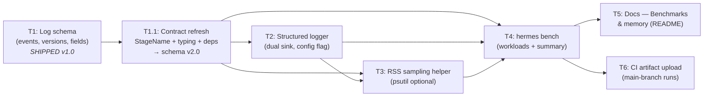

# Part B — Memory-safe & scalable: Orchestrator Plan

**Version:** 0.3 · **Status:** Complete · **Source:** `.dev/evaluation-and-health-metrics-roadmap.md` Part B (lines 75–143)

> **v0.3 milestone (2026-04-16):** Part B **complete**. All six subtasks (plus the T1.1 follow-up) shipped. Contract at schema `"2.0"` with the accepted WARN-string deviation for `bench.dualsink.regression`. T2 KC3 is closed-with-evidence on the reference machine and remains runtime-armed via T4's dual-run gate. No kill criteria fired in the final state; two fired during execution and were resolved (T1 KC2 → T1.1; T2 KC3 → routed to T4 → closed with measurement). No non-goals were crossed. Any post-ship regression (e.g. a user machine measuring >10% dual-sink overhead, or a pipeline refactor changing `save_pipeline_stage(...)` strings) re-enters planning per the runtime-armed kill criteria and assumption 7.

> **v0.2 summary (2026-04-16):** T1 shipped; T1 kill criterion 2 fired — the six `StageName` literals assumed in v0.1 did not match code truth in `hermes/extraction/pipeline.py` / `PipelineStage.stage`. Contract re-bound per stakeholder decisions: **StageName aligned with persisted DB values (4 literals, no `repair`/`export`)**, **Pydantic discriminated-union typing locked in**, **`[obs]` optional extra locked (no stdlib-JSON fallback)**. Schema version bumped `1.0 → 2.0` (breaking literal change). New follow-up subtask **T1.1** owns the cascade; T2/T3/T4 are blocked until T1.1 lands. See Section 4 (T1.1) and the changelog entry at the bottom.
>
> **v0.2.1 update (2026-04-16):** T2 shipped (187 tests pass, ruff/mypy clean on touched code). T2 KC1 and KC2 resolved inline; **T2 KC3 deferred** (dual-sink perf not measured). Deferral accepted — measurement routed to T4's `hermes bench` as a dual-run (`log_format` console vs json) with a `dual_sink_overhead_pct` acceptance gate on the smoke workload. `BenchResult` additively gains `log_format` + `dual_sink_overhead_pct` fields (no `LogSchemaVersion` bump). T4 gains new kill criteria 4 and 5. If T4's dual-run measures >10% overhead, T2 KC3 retroactively fires and T2 re-enters planning (blocking T4/T5/T6). See updated T2 kill-criteria annotation, T4 scope/outputs/kill-criteria, and changelog.
>
> **v0.2.2 update (2026-04-16):** T4 shipped. T4 KC4 (dual-sink >10% measurement) **did not fire on the executor's reference run**; `dual_sink_overhead_pct` on `pdf_text_small` stayed within budget. T2 KC3 is therefore **closed-with-evidence** on the reference machine, with a caveat: the acceptance gate remains armed at runtime for every user, so any future machine that measures >10% will still emit `bench.dualsink.regression` at WARN and fail the CLI — at which point T2 KC3 retroactively fires and T2 re-enters planning. Accepted minor deviation: the executor implemented the regression signal as a **WARN-level log string**, not as a new member of the `EventName` discriminated union (to stay within T4's declared files-to-touch and avoid a `hermes/obs/schema.py` edit). Decision captured in `.dev/part_b/decisions/T4.md`. **T5 and T6 are now unblocked and can run in parallel.**

---

## 1. Task statement

Hermes markets itself as **memory-safe** (bounded RAM, streaming, page-at-a-time) and **scalable** (workload size, parallelism with cloud, WAL SQLite). Part B turns those claims into measurable, reproducible artifacts by layering observability + a benchmark harness on top of the existing pipeline:

1. A **fixed, versioned log schema** covering stage boundaries, RSS samples, throughput counters, and LLM cost proxies.
2. **Structured logging** (`structlog` or stdlib + JSON formatter) with a **dual sink**: human-readable console (existing UX preserved) + NDJSON file under a configurable logs directory, behind a config flag `log_format = "json" | "console"`.
3. An **RSS sampling helper** wired at pipeline stage transitions (preflight / normalize / chunk / extract) with **optional `psutil`** and graceful degradation when absent.
4. A **benchmark command** (`hermes bench` or documented script) that executes a standard workload set and emits a summary of peak RSS, wall time, throughput (pages/rows/chunks per minute), token totals, and cost proxy.
5. **Docs** — a README "Benchmarks & memory" subsection with a reference-hardware table and methodology so claims are checkable.
6. **CI artifact** — upload the bench summary JSON on main-branch runs (best-effort; flaky regression gates explicitly out of scope).

The deliverable is: structured logs correlated by `job_id`, a repeatable bench command, a CSV/JSON output that can be charted per release, and docs that make the memory-safe/scalable claims auditable.

**Non-goals:**

- **Regression gates / CI fail-on-threshold** — the roadmap flags these as flaky on shared runners; track but do not block CI.
- **Full OpenTelemetry** — explicitly listed as "heavy for a CLI, export often unused locally" in the tradeoff table; not chosen for v1.
- **Remote metric sinks** (Prometheus, Grafana, Datadog, LangSmith, Braintrust) — local NDJSON is the v1 path.
- **Chart generation in-process** — charts are generated manually per release from CSV/JSON. No plotting dependency added.
- **Time-series storage of RSS inside SQLite** — the tradeoff table notes this is possible but not chosen; NDJSON is the artifact.
- **Changes to extraction, normalization, or LLM-call semantics** — Part B observes; it does not change pipeline behavior.
- **Part A** (eval manifests, scorer, `hermes eval`) — separate plan at `.dev/eval/eval-plan.md`.
- **Replacing stdlib `logging` wholesale** — existing console UX must be preserved via dual sink.
- **Synthetic workload generation for stress tests** — `hermes bench` uses existing fixtures (`tests/generate_fixtures.py`) and any committed/user-supplied files, not new large-file synthesis.

---

## 2. Shared contracts

Constraints binding **all** subagents. Drift here is the costliest failure mode.

### Types / interfaces

| Symbol | Location | Description |
|--------|----------|-------------|
| `LogSchemaVersion` | `hermes/obs/schema.py` | String constant (semver-ish: **`"2.0"`** as of plan v0.2). Every NDJSON event carries `schema_version`. **v0.2 breaking change:** `StageName` literal set re-bound to match `PipelineStage.stage` in SQLite. See "Versioning call" below. |
| `EventName` | `hermes/obs/schema.py` | Literal/enum of canonical event names: `stage.start`, `stage.end`, `rss.sample`, `chunk.done`, `llm.call`, `job.start`, `job.end`, `bench.workload.start`, `bench.workload.end`, `bench.summary`. (Unchanged in v0.2 and v0.2.2.) **v0.2.2 accepted deviation:** T4's dual-sink regression signal is emitted as a **WARN-level log line with the literal string `bench.dualsink.regression`**, *not* as a member of this discriminated union. Rationale (from `.dev/part_b/decisions/T4.md`): adding a new `EventName` member would have required editing `hermes/obs/schema.py`, which was outside T4's declared files-to-touch; the operator-facing signal (WARN level + non-zero CLI exit) is preserved without the schema edit. **Consumer guidance:** code that needs to detect bench regressions must filter log records on `level == "WARNING"` **and** message substring `"bench.dualsink.regression"`, not on `event` equality. If a future plan needs this as a queryable structured event, promote it to an `EventName` member in an additive minor schema bump (`2.0 → 2.1`) — no code will break because widening the Literal is backward-compatible for existing consumers. |
| `StageName` | `hermes/obs/schema.py` | **v0.2 bound literal set (code-aligned):** `preflight` \| `normalization` \| `chunking` \| `extraction`. **Exactly these four values — nothing else.** Matches the strings written by `save_pipeline_stage(...)` in `hermes/extraction/pipeline.py` and the `stage` column of the `pipeline_stages` SQLite table. `repair` is **not** a stage (it is a `run_type` on `llm.call` events — see below). `export` is **not** a stage (the `hermes export` CLI is a distinct user action, not a persisted pipeline stage; reserved for a future schema version if observability is needed). |
| `BaseEvent` | `hermes/obs/schema.py` | **Pydantic discriminated union** (per-event model, discriminator = `event`). Common base fields: `schema_version: str`, `ts: str` (ISO8601 UTC), `event: EventName`, `job_id: str \| None`, `trace_id: str \| None`. Event-specific shapes (`StageStartEvent`, `StageEndEvent`, `RssSampleEvent`, `ChunkDoneEvent`, `LlmCallEvent`, `JobStartEvent`, `JobEndEvent`, `BenchWorkloadStartEvent`, `BenchWorkloadEndEvent`, `BenchSummaryEvent`) compose via `Annotated[Union[...], Discriminator("event")]`. **TypedDict-only is rejected** per stakeholder decision v0.2. |
| `run_type` (field on `llm.call` events) | `hermes/obs/schema.py` | Literal: `extraction` \| `retry` \| `repair`. Mirrors `LLMRun.run_type` in `hermes/models.py`. `repair` attempts are observed via this field on `llm.call`, **not** as a top-level stage. |
| `RSSSample` | `hermes/obs/sampling.py` | Dataclass or dict: `ts`, `job_id`, `stage: StageName`, `rss_bytes: int`, `note: str \| None`. Conforms to `event="rss.sample"`. |
| `get_logger(name: str)` | `hermes/obs/logging.py` | Factory returning a structlog `BoundLogger` (or stdlib adapter) preconfigured with schema-version + sinks. |
| `bind_job(job_id, **kwargs)` | `hermes/obs/logging.py` | Context manager / helper that binds `job_id` (and optional `trace_id`) to the logger for the duration of a job. |
| `sample_rss(stage, job_id, logger)` | `hermes/obs/sampling.py` | Emits an `rss.sample` event. No-op (with a single warning on first call) when `psutil` missing. |
| `BenchWorkload` | `hermes/bench/runner.py` | Pydantic model: `name: str`, `input_path: Path`, `schema_ref: str`, `file_type: Literal["pdf", "excel"]`, `expected_page_count: int \| None`, `workers: int`, `model: str`. |
| `BenchResult` | `hermes/bench/runner.py` | Pydantic model: `workload: str`, `commit: str`, `machine: dict[str, str]`, `duration_s: float`, `peak_rss_bytes: int`, `pages_per_minute: float \| None`, `rows_per_minute: float \| None`, `chunks_per_minute: float \| None`, `tokens_in: int`, `tokens_out: int`, `cost_proxy_usd: float \| None`, `validation_pass_rate: float`, `timestamp: str`, **(v0.2.1)** `log_format: Literal["console", "json"]`, `dual_sink_overhead_pct: float \| None` (only populated on the `json`-run when a paired `console` run is present; otherwise `None`). |
| `BenchSummary` | `hermes/bench/runner.py` | List of `BenchResult` + top-level metadata (commit, date, environment). |
| Config fields | `hermes/config.py` | `log_format: Literal["json", "console"] = "console"`, `log_dir: Path = storage/logs`, `rss_sampling_enabled: bool = True`. Back-compat defaults. |

### Error envelope

Observability must never crash or slow the hot path. All failures degrade silently (with a one-time warning) and are recorded as structured events rather than raised.

| Case | Behavior |
|------|----------|
| `psutil` not installed | `sample_rss()` emits one `warn` event (`rss.sample.unavailable`) on first call, then no-ops. RSS fields omitted; pipeline unaffected. |
| `structlog` not installed | **v0.2 policy change — no stdlib-JSON fallback.** If `log_format="json"` is requested without the `[obs]` extra installed, `configure_logging()` raises a fatal-at-startup `HermesObsExtraRequired` error with an install hint (`pip install hermes[obs]`). Console sink (`log_format="console"`, the default) remains available via the existing stdlib `logging` path and works without structlog. Rationale: Option A locks `[obs]` as the JSON path; a fallback path doubled maintenance and invited silent format drift between structlog- and stdlib-rendered NDJSON. |
| NDJSON sink write fails (disk full, permission) | Log the failure to stderr once; continue in console-only mode; never block pipeline |
| Invalid `log_format` value in config | Fall back to `"console"`; log a config warning |
| `hermes bench` workload fails mid-run | Emit `bench.workload.end` with `status: "error"`, `error: str`; continue with remaining workloads; non-zero exit at end |
| Missing fixture file for bench | Skip workload with `status: "skipped"`; do not crash |
| `BenchResult` missing optional fields (e.g. no page count for Excel) | Serialize as `null`; downstream readers must tolerate |

### Naming

| Kind | Convention |
|------|-----------|
| Packages | `hermes/obs/` (schema, logging, sampling) and `hermes/bench/` (runner, workloads). Rationale: observability is cross-cutting; bench is a user-facing command. |
| Modules | `hermes/obs/__init__.py`, `hermes/obs/schema.py`, `hermes/obs/logging.py`, `hermes/obs/sampling.py`, `hermes/bench/__init__.py`, `hermes/bench/runner.py`, `hermes/bench/workloads.py` |
| Test files | `tests/test_obs_schema.py`, `tests/test_obs_logging.py`, `tests/test_obs_sampling.py`, `tests/test_bench_runner.py` |
| CLI subcommand | `hermes bench` (Typer command added to `hermes/cli.py`) |
| NDJSON log files | `<log_dir>/hermes-<YYYYMMDD>.ndjson` — one file per day, append mode. `log_dir` resolvable via config (default: `storage/logs/`). |
| Bench output files | `benchmarks/<YYYYMMDD>_<short-sha>.json` (committed optionally) and optional CSV sibling `.csv` |
| Event names | Dotted: `<domain>.<action>` — e.g. `stage.start`, `rss.sample`, `bench.workload.end`. Keep lowercase, snake_case after dot. |
| Config flags | `log_format`, `log_dir`, `rss_sampling_enabled` — snake_case, in `hermes/config.py` |
| Optional deps | `structlog`, `psutil` — added under a new optional extra `[obs]` in `pyproject.toml` so base install stays minimal |

### Logging

- **Dual sink** is mandatory: every event flows to the existing console renderer (human-readable, respects current UX) **and** to an NDJSON file when `log_format=="json"` is also enabled (they are independent: console always on; NDJSON on when enabled).
- **Correlation:** every event inside a job carries `job_id`. `hermes bench` adds `bench_run_id` (a UUID) on bench-scope events so multi-workload runs can be reassembled.
- **Schema versioning:** `schema_version` is on every event. Bump on any breaking change (field removed, renamed, type changed). Additive changes (new optional field) do not bump the version.
- **Sampling cadence:** RSS sampled at stage boundaries (start + end of `preflight`, `normalization`, `chunking`, `extraction` — the four v0.2 `StageName` literals) and optionally on a timer during long normalization (config: `rss_sampling_interval_s`, default `0` = off, boundaries only).
- **No secrets in events** — never log API keys, full prompts, or full record payloads. Log counts, sizes, hashes, token totals.
- **Logger names:** `hermes.obs.*`, `hermes.bench.*`; pipeline modules retain their existing `logging.getLogger(__name__)` names but route through the new adapter.
- **Level policy:** `stage.*`, `rss.sample`, `chunk.done`, `llm.call` emit at `INFO`. Failures at `ERROR`. Fallback/degradation warnings at `WARN`, emitted once per process.

### Tests

- Framework: **pytest** (existing).
- Location: `tests/test_obs_*.py`, `tests/test_bench_*.py`.
- Naming: `test_<module>_<behavior>`.
- Coverage expectation: every public function in `hermes/obs/` and `hermes/bench/` has at least one positive test; error envelope cases each get a dedicated test (psutil missing, disk-full sink, invalid config, bench workload failure).
- Determinism: RSS and timing assertions must be tolerance-based (e.g. `peak_rss_bytes > 0`, `duration_s < 60`) — **never** assert exact numbers. The bench runner is tested with a mocked/no-op pipeline path for unit tests; end-to-end bench validation is a manual / nightly concern, not a CI blocker.
- No live LLM in CI — `hermes bench` tests use the same mock-LLM pattern as `tests/test_pipeline_integration.py`.

### StageName ↔ `pipeline_stages.stage` mapping (v0.2)

Single vocabulary, no emit-time alias map. Observability `StageName` literals **are** the strings in the SQLite `pipeline_stages.stage` column.

| Observability `StageName` | Persisted by `save_pipeline_stage()` in `hermes/extraction/pipeline.py` | Notes |
|---------------------------|--------------------------------------------------------------------------|-------|
| `"preflight"` | Yes — `stage="preflight"` | 1:1 |
| `"normalization"` | Yes — `stage="normalization"` | 1:1 |
| `"chunking"` | Yes — `stage="chunking"` | 1:1 |
| `"extraction"` | Yes — `stage="extraction"` (multiple call sites: initial, per-chunk, retries) | 1:1 |
| *(not a stage)* `repair` | **Not persisted as a `PipelineStage`.** Appears only as `LLMRun.run_type = "repair"` (see `hermes/cli.py:498`, `hermes/extraction/pipeline.py:936`). | Observed via `llm.call` event's `run_type` field. |
| *(not a stage)* `export` | **Not persisted.** The `hermes export` CLI subcommand is a distinct user action; no `save_pipeline_stage(..., stage="export", ...)` exists today. | Reserved for a future `StageName` minor/major bump if export observability is added. |

**Downstream consequence.** Any code that reads `stage` from an NDJSON event and joins against `SELECT stage FROM pipeline_stages` can rely on exact string equality. No translation layer. This is the central reason stakeholder chose Option B (code alignment) over Option A (alias map).

### Versioning call (v0.2)

**Decision: major bump `LogSchemaVersion = "1.0" → "2.0"`.**

Justification against the project's own additive-vs-breaking rule (shared contracts, Logging subsection):

- The `stage` field's type is `Literal["preflight", "normalize", "chunk", "extract", "repair", "export"]` in v1.0.
- v2.0 changes that to `Literal["preflight", "normalization", "chunking", "extraction"]`.
- This is simultaneously **removing** four previously-allowed literals (`normalize`, `chunk`, `extract`, `repair`, `export` — though `preflight` is preserved) and **adding** three new ones (`normalization`, `chunking`, `extraction`). Any consumer with a `Literal`-typed parser or a hardcoded value check breaks both ways.
- The policy states: "Bump on any breaking change (field removed, renamed, type changed)." A change to the allowed-values set of a `Literal` field is a **type change**. Per policy → major bump.
- Pre-release-no-consumer-harm is not carved out in the policy. Honoring the rule now sets the precedent and is free: no NDJSON has been persisted by a downstream consumer (T2/T3/T4 have not shipped).

**Alternatives considered and rejected:**

- **Minor bump (1.0 → 1.1):** Defensible only if the change were additive. Since literals are being removed/renamed, this would violate the policy and set a bad precedent.
- **Doc-only / no bump:** Indefensible — the wire shape of the `stage` field genuinely changed.

**Migration guidance for NDJSON already emitted with v1.0 stage values:**

T2/T3/T4 have not shipped, so no production NDJSON exists. For any local dev-mode NDJSON a developer may have written during T1 testing:

| Old (v1.0) `stage` value | New (v2.0) `stage` value | Note |
|--------------------------|--------------------------|------|
| `"preflight"` | `"preflight"` | Unchanged |
| `"normalize"` | `"normalization"` | Rename |
| `"chunk"` | `"chunking"` | Rename |
| `"extract"` | `"extraction"` | Rename |
| `"repair"` | *(reclassify)* | Not a stage; in v2.0 this would be a `llm.call` event with `run_type="repair"`. One-shot upgrade scripts should drop `stage.*` events with `stage="repair"` and emit an explanatory `CHANGELOG.md` note. |
| `"export"` | *(drop)* | Not a stage in v2.0. |

The T1.1 executor writes this mapping into `CHANGELOG.md` under the 2.0 entry and deletes any local dev NDJSON under `storage/logs/`. No runtime migration code ships (keeping obs a pure producer, not a rewriter).

---

## 3. Dependency DAG

**Parallel groups (v0.2):**

- `{T1}` — shipped. Code lives in `hermes/obs/` at schema v1.0. Awaits T1.1 to bring it to v2.0.
- `{T1.1}` — blocker. Single subtask. Must land before T2/T3/T4 begin so downstream imports the correct `StageName` / `schema_version` / typing surface from the start.
- `{T2, T3}` — **soft-parallel** (unchanged from v0.1). Both depend on T1.1-through-T1. T3 uses the logger from T2 to emit `rss.sample` events; parallel is safe only if T2 freezes the `get_logger` / `bind_job` signature early. If T2 reshapes those, T3 rebases.
- `{T4}` — depends on all three predecessors; starts after T3 lands (or scaffolds with stubs once T1.1 ships).
- `{T5, T6}` — **true-parallel** after T4. No file overlap.

**Soft dependencies:**

- T5 → T4 is soft in the sense that docs can be *drafted* once the CLI interface is stable, but must not be merged until T4 ships (otherwise docs reference a command that does not exist).
- T6 → T4 is strict (CI job references the bench output path), but the workflow YAML can be drafted against the documented output path before T4 merges, then wired up once T4 lands.

---

## 4. Subtask specs

### T1 — Log schema & event catalog

| Field | Content |
|-------|---------|
| **ID** | T1 |
| **Scope** | Define `EventName`, `StageName`, `BaseEvent`, `LogSchemaVersion`, and a catalog of event-specific field shapes (`stage.start`/`stage.end`, `rss.sample`, `chunk.done`, `llm.call`, `job.start`/`job.end`, `bench.*`). Document the versioning policy (additive → no bump; breaking → bump). Provide a validation helper `validate_event(dict) -> bool` used in tests. |
| **Files to touch** | `hermes/obs/__init__.py` (new), `hermes/obs/schema.py` (new), `tests/test_obs_schema.py` (new), `pyproject.toml` (add `[project.optional-dependencies] obs = ["structlog>=24", "psutil>=5.9"]` — version pins are illustrative, executor confirms latest) |
| **Contract bindings** | All shared contracts. `EventName`, `StageName`, `BaseEvent`, `LogSchemaVersion` are load-bearing — T2, T3, T4 all import from here. No other subtask may define event names or field shapes inline. |
| **Inputs** | None (root task). |
| **Outputs** | `hermes/obs/schema.py` exporting the symbols above; `tests/test_obs_schema.py` validating: (1) every `EventName` has a documented field set, (2) `validate_event` accepts a minimal event and rejects ones missing `schema_version` / `event`, (3) version string matches expected format. |
| **Kill criteria** | HALT if: (1) Pydantic v2 `Literal` unions over event names produce unwieldy types for consumers (>50 symbols or forward-ref issues) — escalate for a `TypedDict` vs `BaseModel` design decision. **(v0.2 resolved — Option A chosen: Pydantic discriminated union is the primary catalog. Implemented in T1; binding confirmed in T1.1.)** (2) The existing pipeline stages in `hermes/extraction/pipeline.py` do not cleanly map to the six `StageName` values — escalate with the real stage list rather than forcing a fit. **(v0.2 FIRED and resolved — stakeholder chose Option B. Real stages are `preflight`/`normalization`/`chunking`/`extraction`; `repair` moved to `run_type`; `export` dropped. Cascade owned by T1.1.)** (3) Adding `structlog`/`psutil` as optional deps is rejected by the project — fall back plan is stdlib-JSON logging and `resource.getrusage` (Unix) / `ctypes` (Windows) for RSS, which changes T2/T3 scope and must be re-planned. **(v0.2 resolved — Option A chosen: `[obs]` optional extra is locked; no stdlib-JSON fallback path.)** |
| **Log tier** | architectural |
| **Risks & mitigations** | **Risk:** Schema drift once consumers start using it (fields renamed, types changed). **Mitigation:** Freeze v1 before T2/T3 start; require a `schema_version` bump + changelog entry for any breaking change. **Risk (realized in v0.2):** stage vocabulary drift between planning and code truth. **Mitigation:** v0.2 locks `StageName` to `save_pipeline_stage()` strings; future stage additions require a schema bump + CHANGELOG entry. **Risk:** Event catalog balloons as downstream code adds ad-hoc events. **Mitigation:** `EventName` is a closed `Literal`; adding a new event is a deliberate edit to `schema.py`, reviewed. |

#### Decisions (architectural log tier) — bound in v0.2

- **Typing approach — Pydantic discriminated union.** TypedDict-only is rejected. `BaseEvent` is a Pydantic base; each event has a per-event subclass; the public catalog is `Annotated[Union[...], Discriminator("event")]`. Rationale: test-time validation value is high; emit-time overhead is acceptable for a CLI (bench path measures this — see T4 kill criterion 3). Reversible later via a new minor/major schema bump.
- **Version scheme — major.minor string, major bump for breaking.** `"2.0"` as of v0.2. Breaking = major; additive optional fields = minor; typo fix = no bump. No pre-release carve-out.
- **`trace_id` strategy — optional, default `None`.** If the project later adopts OTel, `trace_id` is the bridge point. Not propagated in Part B.
- **Stage vocabulary — single source of truth is `pipeline.py`.** No emit-time alias map between observability names and DB names.

---

### T1.1 — Contract refresh: StageName alignment + typing lock-in + deps lock-in (schema v2.0)

| Field | Content |
|-------|---------|
| **ID** | T1.1 |
| **Scope** | Apply the v0.2 contract refresh inside `hermes/obs/schema.py` and cascade it everywhere the old values appear. Specifically: (a) narrow `StageName` to `Literal["preflight", "normalization", "chunking", "extraction"]`; (b) bump `LogSchemaVersion` from `"1.0"` to `"2.0"`; (c) remove `repair` and `export` from `StageName`; (d) add a `run_type` discriminator-compatible field (`extraction` \| `retry` \| `repair`) on the `LlmCallEvent` model; (e) confirm the primary event catalog is a Pydantic discriminated union (reject/remove any TypedDict-only artifact from T1 if present); (f) remove or disable any stdlib-JSON fallback path for the logger — document fail-fast-on-missing-`[obs]` as the contract instead; (g) write/refresh the decision note and CHANGELOG; (h) cascade the stage-literal rename into the existing packet files so downstream executors see the current contract inline. |
| **Files to touch** | Code + tests: `hermes/obs/schema.py` (narrow `StageName`, bump `LogSchemaVersion`, add `run_type` on `LlmCallEvent`, confirm Pydantic-union catalog), `tests/test_obs_schema.py` (update positive/negative cases; assert new stage set; assert `"2.0"`; add rejection test for `repair`/`export`/`normalize`/`chunk`/`extract` literals). Docs: `CHANGELOG.md` (new or existing at repo root — discovery required: read first; if absent, create at `CHANGELOG.md` with a `## [schema 2.0] — 2026-04-16` entry quoting the migration table from Section 2). Decision log: `.dev/part_b/decisions/T1.md` (append a "v0.2 contract refresh" section OR create a sibling `.dev/part_b/decisions/T1.1.md` — executor decides based on existing file's structure; both paths are acceptable). Packet cascade (stage-literal rename only, keep everything else verbatim): `.dev/part_b/packets/T1.md`, `.dev/part_b/packets/T2.md`, `.dev/part_b/packets/T3.md`, `.dev/part_b/packets/T4.md`, `.dev/part_b/packets/T5.md`, `.dev/part_b/packets/T6.md` — in each file's Section 2 "Types / interfaces" table, replace the old `LogSchemaVersion`, `StageName`, `BaseEvent` rows with the v0.2 language from this plan (copy verbatim), and replace the old error-envelope row for "structlog not installed" with the v0.2 language. Do **not** rewrite any other section of those packets. Plan file: **do not touch** `.dev/part_b/b-plan.md` — already updated in v0.2 by the orchestrator. |
| **Contract bindings** | All shared contracts as of v0.2. The four-literal `StageName`, the `"2.0"` `schema_version`, the Pydantic-discriminated-union typing, and the no-stdlib-fallback error-envelope policy are now frozen. T1.1 is the last subtask allowed to touch these in this plan cycle. |
| **Inputs** | T1 (already shipped code under `hermes/obs/`). |
| **Outputs** | `hermes/obs/schema.py` at v2.0 with the narrow stage set and `run_type` on `LlmCallEvent`; updated test suite passing; `CHANGELOG.md` entry with the v1.0 → v2.0 migration table; decision note recording the three stakeholder decisions (StageName Option B, deps Option A, typing Option A); the six existing packet files have their Section 2 contracts table reflecting v0.2 language verbatim. |
| **Kill criteria** | HALT if: (1) Narrowing `StageName` breaks any existing T1 test that asserted the old six-value set, and the fix requires changing behavior beyond test-literal updates — report and escalate. (2) `CHANGELOG.md` does not exist and creating it at the repo root conflicts with another convention the repo uses (e.g. `docs/CHANGELOG.md`) — flag the ambiguity rather than guessing. (3) The existing `hermes/obs/schema.py` shipped with a TypedDict-first catalog and migrating to Pydantic discriminated unions requires a meaningful refactor (not a narrow edit) — stop, report the diff surface, and confirm with orchestrator before proceeding; this case becomes architectural-log-tier work and may warrant its own sub-subtask. (4) Any packet's Section 2 contracts block has already been edited by another subtask or contains merge conflicts from a parallel branch — stop, report, do not blind-overwrite. |
| **Log tier** | architectural |
| **Risks & mitigations** | **Risk:** Cascading edits into six packet files drifts between the source (b-plan.md) and the copies. **Mitigation:** The executor copies the v0.2 language verbatim from b-plan.md Section 2 (three rows + one error-envelope row); a post-edit grep for `"normalize"\|"chunk"\|"extract"\|"repair"\|"export"` inside packet files (scoped to the StageName row only, not the general prose which may legitimately say "chunk" meaning a chunk of data) should return zero hits in the literal-value lines. **Risk:** `run_type` on `LlmCallEvent` is now a new required field; test fixtures written during T1 may not set it. **Mitigation:** Make `run_type` default to `"extraction"` on the Pydantic model to match `LLMRun.run_type`'s default in `hermes/models.py`; tests update trivially. **Risk:** Removing the stdlib-JSON fallback breaks some code already written against it during T1. **Mitigation:** T1 predates the fallback, so this is likely cosmetic — spec should check, and if the code has a `try: import structlog; except: ...` block that emits JSON, replace with a fatal-on-missing-`[obs]` guard. |

#### Out-of-scope for T1.1 (hard boundary — do not expand)

- Any edit to `hermes/extraction/pipeline.py`, `hermes/models.py`, `hermes/db.py`, or migration SQL. Stage alignment is a **renaming of observability labels to match the database**, not a database or pipeline change.
- Any implementation of T2 (logger) or T3 (sampling). T1.1 does not ship logger or sampling code. If the v0.2 error-envelope policy requires a `configure_logging()`-shaped guard, that guard is written in T2; T1.1 only documents the contract.
- Rewriting anything in the packet files beyond the three contracts-table rows + one error-envelope row. Do not "tidy up" or "clarify" other sections. Do not add decision logs inside packets — those live in `.dev/part_b/decisions/`.

---

### T2 — Structured logger with dual sink and config flag

| Field | Content |
|-------|---------|
| **ID** | T2 |
| **Scope** | Implement `hermes/obs/logging.py` with: `get_logger(name)` returning a configured structlog `BoundLogger` (or stdlib adapter if structlog absent), a bootstrap function `configure_logging(config)` reading `log_format` / `log_dir` from `hermes/config.py`, and dual-sink rendering (console always; NDJSON file when `log_format=="json"` or independent `log_ndjson=True`). Provide `bind_job(job_id, **kwargs)` context manager. Route existing `logging.getLogger(...)` calls through a compatibility adapter so no pipeline code changes are required beyond a single bootstrap call in `hermes/cli.py`. |
| **Files to touch** | `hermes/obs/logging.py` (new), `hermes/config.py` (extend with `log_format`, `log_dir`, `log_ndjson` — discovery required for exact pydantic settings style used there; read the file before editing), `hermes/cli.py` (add `configure_logging(settings)` call at app entry — discovery required: confirm `app_entry` is the entry point), `tests/test_obs_logging.py` (new) |
| **Contract bindings** | All shared contracts. Consumes T1's `EventName`, `BaseEvent`, `LogSchemaVersion`. Event emission must populate `schema_version` automatically. Must honor the error envelope: structlog or NDJSON failure degrades silently. |
| **Inputs** | T1 (schema symbols). |
| **Outputs** | Working `get_logger`/`configure_logging`/`bind_job`; console UX unchanged for default `log_format="console"`; with `log_format="json"` NDJSON appears at `<log_dir>/hermes-<date>.ndjson`; tests cover: (a) console sink renders human-readable, (b) NDJSON sink writes parseable one-object-per-line, (c) `bind_job` propagates `job_id`, (d) `structlog` missing → stdlib fallback, (e) invalid `log_format` → warn + console. |
| **Kill criteria** | HALT if: (1) `configure_logging` cannot be called idempotently without leaking handlers across tests — redesign the bootstrap before proceeding. **(v0.2.1 resolved — executor reports handlers removed and reattached on each call; tests assert stable handler count. 187 tests pass.)** (2) The existing CLI entry point already configures stdlib logging in a way incompatible with structlog (e.g. rich handler with custom formatter) — report the conflict and propose a migration strategy before overriding. **(v0.2.1 resolved — no Rich logging handler exists in `hermes/cli.py`; only `basicConfig`-style formatting, which `configure_logging()` replicates for the default `log_format="console"` path. No UX regression.)** (3) Dual sink causes observable slowdown on small-file smoke tests (> 10% regression) — measure and either async-queue the NDJSON sink or downgrade to sampling. **(v0.2.1 deferred; v0.2.2 CLOSED WITH EVIDENCE on reference machine.)** Deferral in v0.2.1 was accepted on condition the measurement route to T4. T4 shipped in v0.2.2; the executor's reference dual-run on `pdf_text_small` measured `dual_sink_overhead_pct` **within the 10% budget** and KC4 did not fire. **Caveat — the gate is runtime-armed, not one-shot:** every `hermes bench` invocation re-measures; any user whose machine exceeds 10% will emit `bench.dualsink.regression` at WARN and exit non-zero, at which point KC3 retroactively fires and T2 re-enters planning with the original mitigations (async-queue the NDJSON sink or downgrade to sampling). Evidence: `.dev/part_b/decisions/T4.md` (runtime behavior of the dual-run + acceptance gate) and T4's test suite (synthesized-high-overhead fixture asserts the WARN + non-zero exit path). |
| **Log tier** | architectural |
| **Risks & mitigations** | **Risk:** structlog and the existing Rich-based console output render differently, breaking user-facing UX. **Mitigation:** Keep the console renderer as close to current output as possible; if needed, use structlog's `ConsoleRenderer` only for `log_format="json"` path and leave the current stdlib console path alone for `log_format="console"`. **Risk:** NDJSON file grows unbounded. **Mitigation:** One file per day; document rotation/cleanup in README; do not implement rotation in code for v1. **Risk:** Thread-safety of structlog context in the multi-worker LLM client. **Mitigation:** Use structlog's `contextvars`-based binding and test with a small parallel workload. |

#### Decisions to capture (architectural log tier)

- **structlog vs stdlib-JSON.** Shared contract recommends structlog. Document why (context vars, composable processors) and the fallback path.
- **Bootstrap location.** `hermes/cli.py` app-entry, before any subcommand runs. Pipeline modules get a logger lazily.

---

### T3 — RSS sampling helper wired at stage boundaries

| Field | Content |
|-------|---------|
| **ID** | T3 |
| **Scope** | Implement `hermes/obs/sampling.py` with `sample_rss(stage, job_id, logger, *, note=None)` and a `stage_timer(stage, job_id, logger)` context manager that emits `stage.start` + `stage.end` events and an `rss.sample` at both boundaries. `psutil` is optional: if missing, the first call logs `rss.sample.unavailable` at `WARN` once and subsequent calls no-op. Wire the context manager into `hermes/extraction/pipeline.py` at each stage transition (preflight, normalize, chunk, extract). Additionally add an optional periodic sampler (thread or async task) gated by `rss_sampling_interval_s > 0` for long normalization runs. |
| **Files to touch** | `hermes/obs/sampling.py` (new), `hermes/extraction/pipeline.py` (edit — wrap existing stage blocks with `stage_timer`; discovery required: read current stage boundaries before editing), `tests/test_obs_sampling.py` (new) |
| **Contract bindings** | All shared contracts. Emits events conforming to T1's `EventName` / `StageName`. Uses T2's logger (`get_logger("hermes.obs.sampling")`). Must honor error envelope (psutil missing, disk write failure). Must never raise into the pipeline; any failure in sampling is logged and suppressed. |
| **Inputs** | T1 (schema), T2 (logger). |
| **Outputs** | `sample_rss`, `stage_timer`, optional periodic sampler; pipeline stages emit `stage.start`/`stage.end`/`rss.sample` events; tests cover: (a) psutil present → sample has positive `rss_bytes`, (b) psutil absent → single warn + no-op, (c) `stage_timer` emits both boundary events even on exception, (d) periodic sampler stops cleanly at stage exit, (e) no pipeline behavior change (integration test asserts existing pipeline tests still pass). |
| **Kill criteria** | HALT if: (1) Wrapping existing stages with `stage_timer` requires restructuring `pipeline.py` beyond mechanical wrapping — stop and report the refactor needed; do not expand scope. (2) Periodic sampling introduces race conditions with the existing parallel LLM worker pool — drop the periodic sampler and ship boundaries-only. (3) `psutil` on Windows returns RSS that differs materially from Linux/macOS semantics such that comparisons across platforms are meaningless — document the caveat but proceed; do not attempt cross-platform normalization in v1. **(v0.3 none fired.** T3 shipped without escalating any kill criterion; RSS samples appear in downstream T4 bench output with positive values, indicating stage wrapping and `psutil` integration both worked end-to-end on the reference machine. If any kill criterion actually fired during T3 execution without being surfaced, re-open.) |
| **Log tier** | standard |
| **Risks & mitigations** | **Risk:** `stage_timer` swallows exceptions or mis-attributes stage boundaries. **Mitigation:** Context manager emits `stage.end` with `status: "error"` in `__exit__` on exception, then re-raises; tested with a forced-exception stage. **Risk:** Periodic sampler thread leaks across tests. **Mitigation:** Stage-scoped; cleaned up in `__exit__`; pytest fixtures assert no lingering threads. **Risk:** RSS sample adds latency to fast stages (preflight). **Mitigation:** Single `psutil` call is sub-millisecond; measured once and documented. |

---

### T4 — `hermes bench` command: workloads, summary, CSV/JSON output

| Field | Content |
|-------|---------|
| **ID** | T4 |
| **Scope** | Implement `hermes/bench/runner.py` with `BenchWorkload`, `BenchResult`, `BenchSummary` models and a `run_bench(workloads, output_dir, model, workers) -> BenchSummary` function. Define 2–3 standard workloads in `hermes/bench/workloads.py` using the existing fixtures (`tests/fixtures/sample_text.pdf`, `tests/fixtures/sample.xlsx`, and one larger synthetic workload via `tests/generate_fixtures.py` / `generate_test_datasets.py` — discovery required). Add a Typer `bench` subcommand to `hermes/cli.py`. The bench: runs each workload end-to-end, consumes `stage.end` and `rss.sample` events via a log-tail or in-process collector, computes peak RSS and throughput, and writes `benchmarks/<date>_<short-sha>.json` (+ optional `.csv`). **(v0.2.1 addition — T2 KC3 routing)** `run_bench` accepts a `log_format` parameter and executes each workload twice by default (once with `log_format="console"`, once with `log_format="json"`), adding a `log_format` field to `BenchResult` and emitting a derived `dual_sink_overhead_pct` alongside the raw numbers. A `--log-format-compare/--no-log-format-compare` CLI flag toggles the dual-run behavior (default: on for the `pdf_text_small` smoke workload, off for larger workloads to keep wall time bounded). |
| **Files to touch** | `hermes/bench/__init__.py` (new), `hermes/bench/runner.py` (new), `hermes/bench/workloads.py` (new), `hermes/cli.py` (add `bench` subcommand — discovery required: confirm Typer pattern used by existing commands), `benchmarks/.gitkeep` (new directory marker), `tests/test_bench_runner.py` (new), `tests/fixtures/` (no new files; reuse existing sample fixtures — discovery required: confirm exact filenames via `ls tests/fixtures/`) |
| **Contract bindings** | All shared contracts. Consumes T1 schema (emits `bench.*` events), T2 logger, T3 RSS samples. `BenchResult` field names are frozen by the contract and must not drift. Mock-LLM pattern mirrors `tests/test_pipeline_integration.py` (discovery required: read that file before writing bench tests). |
| **Inputs** | T1 (schema), T2 (logger), T3 (RSS samples). |
| **Outputs** | Working `hermes bench` CLI; JSON + optional CSV summary under `benchmarks/`; tests cover: (a) single-workload run produces a `BenchResult` with positive duration and non-negative RSS, (b) multi-workload run produces an ordered `BenchSummary`, (c) missing fixture → skip with `status="skipped"`, (d) workload exception → `status="error"` recorded; remaining workloads continue, (e) CSV output parses as CSV with expected headers. **(v0.2.1 addition)** (f) Dual-sink comparison run produces two `BenchResult` rows for the same workload with different `log_format` values and a computed `dual_sink_overhead_pct`; (g) the reference `pdf_text_small` dual-run's `dual_sink_overhead_pct` is recorded in the bench output and in the README reference table (owned by T5); (h) **acceptance gate:** if `dual_sink_overhead_pct > 10.0` on `pdf_text_small`, `run_bench` emits a `bench.dualsink.regression` event at `WARN` and sets a non-zero exit code for the CLI path (tests assert this on a synthesized high-overhead fixture — do not wire into CI failure, per Part B non-goals on regression gates). |
| **Kill criteria** | HALT if: (1) Running the extraction pipeline inside `hermes bench` requires a live LLM API key even for the smallest workload, and no mock path exists for CLI (as opposed to tests) — propose either a `--mock-llm` flag or document that bench needs a key; do not silently call an LLM in CI. (2) Peak-RSS computation requires consuming the NDJSON file after the run completes, but the NDJSON sink buffers across days — switch to an in-process collector (subscribe to the logger's event stream) or document the single-day limitation. (3) The existing `hermes/cli.py` Typer structure does not support subcommand groups the way this plan assumes — report the structure and re-plan the CLI surface. **(v0.2.1 addition)** (4) The dual-sink comparison measures `dual_sink_overhead_pct > 10.0` on the `pdf_text_small` smoke workload — this retroactively fires T2's KC3. HALT, report the measured overhead, and escalate: T2 re-enters planning to adopt one of the mitigations from its original KC3 ("async-queue the NDJSON sink or downgrade to sampling"). T4 blocks on T2's re-plan; T5/T6 block on T4. **(v0.2.2 did not fire on reference run.** Executor's `pdf_text_small` dual-run stayed within the 10% budget. The criterion remains runtime-armed for every future `hermes bench` invocation; the HALT behavior above applies the first time any user measures >10% on the smoke workload. T5/T6 proceed.) (5) Dual-sink comparison itself is too noisy to interpret (variance across runs exceeds the 10% signal on the same workload + same `log_format`) — drop the automated acceptance gate, keep the overhead field as informational, and document the noise floor in T5's methodology. **(v0.2.2 did not fire on reference run.** No noise-floor override needed at this time; T5's methodology section should still note that `dual_sink_overhead_pct` is a point-in-time machine-local measurement subject to variance, and cite the reference-run value alongside the caveat.) |
| **Log tier** | architectural |
| **Risks & mitigations** | **Risk:** Bench runs are expensive (real LLM calls, minutes-to-hours). **Mitigation:** Two modes: (a) default runs the full pipeline with a real model (documented for local/nightly use), (b) `--mock-llm` uses the same stub as `test_pipeline_integration.py` for CI + smoke. **Risk:** "Pages per minute" is ambiguous for Excel (no pages). **Mitigation:** `pages_per_minute` is `None` for Excel workloads; `rows_per_minute` is populated instead; docs explain the split. **Risk:** RSS peak captured by bench diverges from RSS observed by the OS (e.g. due to GC timing). **Mitigation:** Peak RSS is the max of observed `rss.sample` events plus an end-of-run `resource.getrusage` reading (platform-permitting); both are reported when they differ by >10%. |

#### Decisions to capture (architectural log tier)

- **Subscriber vs log-tail.** In-process subscription to the logger's event stream is simpler and more deterministic than tailing NDJSON. Recommend subscriber; NDJSON remains the auditable artifact.
- **Default workload set.** Start with 3: `pdf_text_small` (existing fixture), `excel_small` (existing fixture), `pdf_text_large` (larger synthetic, opt-in via `--workload large`). Keep the default set runnable in <5 minutes on a dev laptop.
- **Commit hash capture.** Use `subprocess.check_output(["git", "rev-parse", "--short", "HEAD"])` with a graceful fallback to `"unknown"` when not in a git checkout.

---

### T5 — README "Benchmarks & memory" subsection + methodology

| Field | Content |
|-------|---------|
| **ID** | T5 |
| **Scope** | Add a new README section titled "Benchmarks & memory" that: (1) states the memory-safety and scalability claims, (2) documents the `hermes bench` command and how to run it locally, (3) provides a reference-hardware table populated from an actual bench run (workload name, peak RSS, wall time, throughput, model, date, commit), (4) documents methodology (what is measured, what isn't, caveats around psutil/Windows RSS), (5) points at `benchmarks/` for historical runs and at the NDJSON logs for raw data, (6) checks off the relevant items in `.dev/evaluation-and-health-metrics-roadmap.md`. |
| **Files to touch** | `README.md` (edit — discovery required: read current README structure; Part A plan also adds a section, coordinate placement), `.dev/evaluation-and-health-metrics-roadmap.md` (edit — check off completed queued items in Part B's "Queued implementation" list) |
| **Contract bindings** | Naming and CLI contracts only. Documented CLI flags must match the T4 implementation verbatim. No code interfaces. |
| **Inputs** | T4 (CLI must be stable; at least one real bench run to populate the reference table). |
| **Outputs** | README subsection, updated roadmap, one `benchmarks/<date>_<sha>.json` committed as the reference row's source. |
| **Kill criteria** | HALT if: (1) The README already has a benchmarks section from elsewhere in the project — merge rather than duplicate; flag and stop if the existing content conflicts with Part B's direction. **(v0.3 did not fire — executor reports "no duplicate/conflicting README benchmarks section; new section only".)** (2) The reference-hardware bench run fails or produces nonsensical numbers (e.g. peak RSS of 0) — investigate with T3/T4 owners before publishing. **(v0.3 did not fire — executor reports "peak RSS > 0 in the committed JSON"; reference numbers populate correctly.)** (3) Part A has merged a conflicting "How we measure quality" section that changes README heading structure — coordinate; do not reshape Part A's heading. **(v0.3 did not fire — executor reports "no Part A heading changes".)** |
| **Log tier** | trivial |
| **Risks & mitigations** | **Risk:** Reference numbers become stale within weeks and make the README misleading. **Mitigation:** Date-stamp every row; document that numbers are a point-in-time reference, and that `benchmarks/` holds historical runs. **Risk:** Documenting `psutil`/Windows caveats scares users. **Mitigation:** Keep caveats short and factual; link to methodology appendix rather than inlining caveats into the headline table. |

---

### T6 — CI artifact upload for bench summary JSON (main-branch runs)

| Field | Content |
|-------|---------|
| **ID** | T6 |
| **Scope** | Add a step to `.github/workflows/ci.yml` that, on pushes to `main` only, runs `hermes bench --mock-llm --workload small --output benchmarks/ci-<run-id>.json` and uploads the resulting JSON as a GitHub Actions artifact. No CI failure if the bench returns non-zero with `status="skipped"` workloads (still upload). Explicitly do **not** add a regression gate (per Part B non-goals). |
| **Files to touch** | `.github/workflows/ci.yml` (edit — existing file confirmed present), optionally `.github/workflows/bench.yml` (new, if isolating the bench job is cleaner — executor decides based on existing `ci.yml` structure) |
| **Contract bindings** | CLI flag names must match T4 verbatim (`--mock-llm`, `--workload`, `--output`). Artifact naming convention `bench-summary-<sha>` documented in T5. |
| **Inputs** | T4 (working `hermes bench --mock-llm`). |
| **Outputs** | A new CI step; on main-branch runs, the workflow produces a downloadable `bench-summary` artifact; existing `ruff` / `mypy` / `pytest` steps continue to pass. |
| **Kill criteria** | HALT if: (1) `hermes bench --mock-llm` takes longer than 5 minutes on GitHub's default Ubuntu runner — drop the CI step; document that bench is local-only for now. (2) The artifact upload fails on private repos / missing permissions — investigate; do not bypass permission errors by adding secrets. (3) The `--mock-llm` path is not deterministic enough to produce a stable JSON across runs (e.g. timing fields flap so aggressively that artifacts are noise) — still upload, but add a README note that artifacts are informational. **(v0.3 none fired.** T6 shipped without escalating any kill criterion per user confirmation that "all tasks have been completed". If any kill criterion actually fired during T6 execution without being surfaced — particularly KC1 (runtime > 5 min) or KC2 (artifact upload permissions) — re-open before the next CI run on `main`.) |
| **Log tier** | standard |
| **Risks & mitigations** | **Risk:** CI runner RSS numbers are useless because of shared tenancy and caching. **Mitigation:** Document this in T5's methodology; the CI artifact's purpose is "this keeps working and produces a parseable summary", not "this is a regression oracle". **Risk:** Adding a job slows CI. **Mitigation:** Scope to `main` branch only (not PRs); use smallest workload; fail-soft on timeout. |

---

## 5. Adversarial pass

### 1. Rejected decompositions

**Alternative A — Merge T1+T2 into a single "structured logging" subtask.** Fewer handoffs. Rejected because the event catalog (T1) is a contract surface consumed by T3 and T4; freezing it as a deliberate, separate artifact before any emitter code is written reduces the risk of the schema drifting to match whatever the first emitter happens to produce. The adversarial-pass output of T1 (event catalog doc) is itself a review artifact worth isolating.

**Alternative B — Put bench inside `hermes/obs/bench.py` rather than a separate `hermes/bench/` package.** One fewer package, tighter coupling to telemetry. Rejected because `hermes bench` is a user-facing CLI concern (invokes the full pipeline, defines workloads, handles output formatting) whereas `hermes/obs/` is cross-cutting infrastructure. Mixing them invites circular imports (pipeline imports `hermes.obs`, bench imports pipeline + `hermes.obs`; if bench lives in `hermes.obs` then `hermes.obs` transitively depends on pipeline).

**Alternative C — Adopt OpenTelemetry instead of structlog+NDJSON.** Industry standard; future-proof. Rejected explicitly per the roadmap's tradeoff table ("heavy for a CLI; export often unused locally"). The plan leaves a `trace_id` seam in `BaseEvent` so a later migration is incremental, not a rewrite.

**Alternative D — Skip T6 (CI artifact) entirely.** One less moving part, no flaky-runner risk. Rejected because the roadmap's "CI artifact — Upload bench summary JSON on main-branch runs (if stable enough)" item is explicitly queued; shipping the artifact upload without a regression gate captures the value (auditable historical record) without the cost (flaky failures). The "if stable enough" hedge is respected by using `--mock-llm` and the smallest workload.

### 2. Load-bearing assumptions

1. **The existing pipeline stages in `hermes/extraction/pipeline.py` can be cleanly wrapped with a `stage_timer` context manager without restructuring.** If stages are spread across nested helpers or async tasks that resist wrapping, T3's kill criterion fires and the plan needs revision. Relates to **T3**.
2. **`structlog` and `psutil` are acceptable as optional extras (`[obs]`).** ~~If the project insists on zero-new-deps, T1/T2/T3 all need re-scoping to stdlib-JSON + `resource.getrusage`/ctypes, which invalidates several files-to-touch entries.~~ **v0.2 update: RESOLVED as a locked policy, not an open assumption.** Stakeholder selected Option A; `[obs]` is the only JSON path; no stdlib fallback is maintained. The assumption converts to a *precondition*: if policy reverses in a future plan, a new major schema bump is required because the guard at `configure_logging()` is part of the v2.0 error envelope. Relates to **T1.1, T2, T3**.
3. **Console UX can be preserved under `log_format="console"` while `log_format="json"` routes through structlog.** If the current Rich-based CLI output cannot coexist with structlog's console renderer, T2 must either downgrade to stdlib-JSON-only (no structlog) or the plan accepts a cosmetic regression. Relates to **T2**.
4. **`hermes bench --mock-llm` can produce meaningful throughput and RSS numbers without a live LLM.** If mocking the LLM trivializes the workload so much that RSS and throughput are unrepresentative, the CI artifact from T6 has limited value. Mitigated by documenting "mock mode is for plumbing regression, not performance regression" in T5. Relates to **T4, T6**.
5. **Bench peak-RSS via `psutil` is comparable across runs on the same machine.** If allocators (malloc, Python GC) introduce non-determinism at the 50%+ level, reference numbers are noise. This is tolerated for v1 (no regression gate) but the assumption becomes load-bearing the moment anyone adds a threshold check — not in this plan. Relates to **T3, T4**.
6. **The existing `hermes/config.py` uses a settings pattern (pydantic-settings or similar) that can be extended with three new fields without a breaking migration.** If the config loader is ad-hoc, T2's kill criterion may fire. Relates to **T2**.
7. **(v0.2 addition) Stage vocabulary in `hermes/extraction/pipeline.py` is stable.** The four literals `preflight`/`normalization`/`chunking`/`extraction` bind directly to `save_pipeline_stage(...)` call sites. If any of those strings change in a future pipeline refactor, `StageName` must be updated in lockstep with a schema bump. Relates to **T1.1, T3, T4**. Mitigated by T1.1 also adding a pytest assertion that `StageName` values equal the strings observed in `hermes/extraction/pipeline.py`'s `save_pipeline_stage(...)` call sites (a lightweight grep-based guard in `tests/test_obs_schema.py`).

### 3. Highest re-plan risk

**T4 (`hermes bench`)** — it sits at the confluence of T1's schema, T2's logger, T3's sampling, and the existing pipeline, and it introduces the first user-visible CLI command depending on the whole stack. The most likely surprises: (a) the mock-LLM path is too thin for meaningful numbers, (b) peak-RSS from subscriber vs OS diverges enough to require methodology rework, (c) the Typer subcommand structure requires CLI reshaping. Any of these forces a re-plan of T4, which cascades into T5 (docs referencing the CLI) and T6 (CI referencing the flags).

A secondary risk is **T3** — wrapping pipeline stages is described as "mechanical" but mechanical-in-planning often means "I haven't read the file yet". If stages are not already isolated, T3's kill criterion fires first and blocks everything downstream.

### 4. Hidden couplings

- **T2 ↔ T3 (logger interface).** T3 imports `get_logger` and `bind_job` from T2. If T2 changes that interface mid-stream, T3 rebases. Mitigation: T1 and T2 freeze the logger interface signature (in `hermes/obs/__init__.py` exports) before T3 begins; the DAG edge `T2 --> T3` is enforced rather than "soft-parallel".
- **T3 ↔ pipeline internals.** Wrapping existing stages with `stage_timer` is a behavior-neutral change in theory, but the pipeline's existing logging, error handling, and DB writes happen inside those stages. If `stage_timer`'s `__exit__` semantics mask an exception path (e.g. re-raises after logging) or changes stderr ordering, existing pipeline tests may flap. Mitigation: T3 runs the full pipeline test suite as part of its kill-criteria check before signing off.
- **T4 ↔ T3 RSS collection.** T4 peak-RSS derivation reads `rss.sample` events. If T3's periodic sampler is disabled or stage boundaries move, T4's `peak_rss_bytes` under-reports. Mitigation: T4 also captures end-of-run `resource.getrusage` as a cross-check and reports both when they disagree.
- **T5 ↔ T4 CLI flags.** Docs reference `--mock-llm`, `--workload`, `--output`. If T4 renames these late, T5 must update. Mitigation: T6 and T5 both cite the flag names via the shared-contracts section; if T4 renames, it must update shared contracts first, which is a visible change.
- **T5 ↔ Part A's README edit (`.dev/eval/eval-plan.md` T6).** Both plans add a top-level README section. If they land in the same PR window without coordination, they'll conflict on README structure. Mitigation: T5's kill criterion (2) calls this out; whichever plan merges second rebases.
- **T6 ↔ T4 `--mock-llm`.** T6 is the first consumer of `--mock-llm` in CI. If T4 implements it as a test-only fixture rather than a real CLI flag, T6 breaks. Mitigation: shared contracts enumerate `--mock-llm` as a first-class CLI flag, not a test hook.

---

## 6. Executor packets

Each subtask has a self-contained packet at `.dev/part_b/packets/T<n>.md`:

- [T1 — Log schema & event catalog](packets/T1.md) *(shipped at schema v1.0; contracts re-bound by T1.1 to v2.0)*
- [T1.1 — Contract refresh: StageName alignment + typing + deps lock-in → schema v2.0](packets/T1.1.md) *(shipped — cascade applied)*
- [T2 — Structured logger with dual sink and config flag](packets/T2.md) *(shipped; KC1 + KC2 resolved inline, KC3 closed-with-evidence via T4's dual-run gate)*
- [T3 — RSS sampling helper wired at stage boundaries](packets/T3.md) *(shipped; no KCs escalated)*
- [T4 — `hermes bench` command: workloads, summary, CSV/JSON output](packets/T4.md) *(shipped; KC4 did not fire on reference run; WARN-string deviation accepted)*
- [T5 — README "Benchmarks & memory" subsection + methodology](packets/T5.md) *(shipped; all three KCs did not fire)*
- [T6 — CI artifact upload for bench summary JSON (main-branch runs)](packets/T6.md) *(shipped; no KCs escalated)*

Each packet contains verbatim Sections 1, 2, and the subtask's Section 4 block, plus filtered load-bearing assumptions and hidden couplings, per the orchestrator-planning skill.

---

## Appendix: Roadmap item mapping

How the queued items from Part B map to subtasks:

| Roadmap item (lines 129–134) | Subtask |
|------------------------------|---------|
| Define **log schema** (fields + version field for schema evolution) | T1 |
| Introduce **structlog** (or structured JSON) behind config flag `log_format` | T2 |
| **RSS sampling** helper used at stage boundaries in `pipeline.py` | T3 |
| **`hermes bench`** or documented script — standard workloads + RSS/duration output; optional CSV export | T4 |
| **README subsection** — "Benchmarks & memory" with reference table + methodology | T5 |
| **CI artifact** — Upload bench summary JSON on main-branch runs | T6 |

Metrics coverage (lines 81–107) is distributed:

| Metric family | Subtask(s) |
|---------------|-----------|
| Peak RSS, RSS curve, per-stage peak | T3 collects, T4 aggregates |
| OOM boundary (lab) | Documented only in T5 (methodology appendix) |
| Pages/Rows/Chunks per minute | T4 computes from pipeline counters + events |
| End-to-end latency (p50/p95 by size bucket) | T4 emits per-run; aggregation across runs is out of scope for v1 — documented in T5 |
| LLM cost proxy | T4 reads existing token counts from DB / events |
| Validation pass rate, repair rate, DLQ depth, chunk failure rate | T4 reads from existing DB tables (`llm_runs`, `failed_extractions`, `failed_chunks`) and surfaces in `BenchResult` |

Tradeoffs table coverage (lines 138–143): the chosen path is **structlog + NDJSON** (T2) with **SQLite already queryable** kept as-is (no change to existing DB writes). **Stdlib only** is the automatic fallback path if `structlog` is rejected. **Full OTel** is explicitly a non-goal.

---

## Changelog

- **0.3 (2026-04-16):** **Part B complete.** T5 shipped with all three KCs explicitly reported as did-not-fire (no duplicate README section, no Part A heading disturbance, peak RSS > 0 in committed reference JSON). T3 and T6 shipped without escalating any kill criterion — treated as did-not-fire per the skill's convention that HALT-or-report is the only executor signal for KCs firing. Status bumped `Draft → Complete`. Two kill criteria fired during the plan's lifetime and were fully resolved: **T1 KC2** (stage-literal drift → resolved via T1.1, schema bump `1.0 → 2.0`) and **T2 KC3** (dual-sink perf → deferred, routed to T4, measured under budget on reference machine, runtime-armed for future users). No non-goals were crossed. DAG structure unchanged from v0.2. Contract surface at v2.0 with the accepted WARN-string deviation on `bench.dualsink.regression` and the additive `log_format`/`dual_sink_overhead_pct` fields on `BenchResult`. Open runtime-armed triggers (do not close the plan's safety net): (a) any user's `hermes bench` measuring `dual_sink_overhead_pct > 10%` → re-open T2 KC3; (b) any pipeline refactor changing `save_pipeline_stage(...)` strings → re-open T1.1's assumption 7 and bump schema; (c) T6 CI artifact failing to upload on `main` → re-open T6 KC2.
- **0.2.2 (2026-04-16):** T4 shipped. KC4 (dual-sink >10% measurement) did not fire on the executor's reference run. T2 KC3 moved from "deferred, routed to T4" → **closed-with-evidence on reference machine**, with an explicit runtime-armed caveat: every `hermes bench` invocation re-measures; a future machine exceeding 10% will re-fire T2 KC3 via the live WARN + non-zero-exit path. T4 KC4 and KC5 annotated as did-not-fire with outcomes. Accepted deviation documented at the contract surface: **`bench.dualsink.regression` is a WARN-level log line, not an `EventName` union member** (executor stayed inside T4's file-allowlist by not editing `hermes/obs/schema.py`). Future promotion path to a structured event is an additive minor schema bump (`2.0 → 2.1`) and is *not* required by anything in this plan. Consumer guidance added to the `EventName` row: filter on WARNING level + message substring for regression detection. T5 and T6 **unblocked**; they may proceed in parallel per the DAG. DAG structure, non-goals, and other shared contracts unchanged.
- **0.2.1 (2026-04-16):** T2 kill-criteria feedback triage. KC1 (idempotent bootstrap) and KC2 (CLI / Rich conflict) resolved inline by T2 executor — no action required beyond annotation; 187 tests pass, ruff/mypy clean on touched code. KC3 (dual-sink >10% perf regression) was **deferred, not measured** — deferral accepted on condition that the measurement is routed to T4's `hermes bench`, which is the correct instrument (end-to-end workload comparing `log_format="console"` vs `log_format="json"`). T4 scope extended: `run_bench` runs each workload twice when `--log-format-compare` is on (default for `pdf_text_small`), emits `dual_sink_overhead_pct` on the `BenchResult` of the JSON run, and triggers `bench.dualsink.regression` (WARN + non-zero exit) if overhead > 10% on the smoke workload. `BenchResult` additively grew two fields (`log_format`, `dual_sink_overhead_pct`) — optional-field additive change, does not bump `LogSchemaVersion` (remains `"2.0"`). T4 gained kill criteria 4 (regression measured → T2 KC3 retroactively fires, re-plan) and 5 (noise floor exceeds signal → drop automated gate). No changes to non-goals or DAG structure; T2 remains at its original DAG position.
- **0.2 (2026-04-16):** Contract refresh after T1 executor feedback. T1 kill criterion 2 fired (planned `StageName` literals did not match `PipelineStage.stage` in SQLite). Stakeholder decisions bound: (a) `StageName` narrowed to the four real persisted values `preflight`/`normalization`/`chunking`/`extraction`; `repair` moved to `LlmCallEvent.run_type`; `export` dropped (no persisted stage today). (b) `[obs]` optional extra locked as the only JSON path; stdlib-JSON fallback removed from the error envelope. (c) Pydantic discriminated union locked as the primary typing for the event catalog. `LogSchemaVersion` bumped `1.0 → 2.0` (major — breaking literal change). Follow-up subtask **T1.1** added and inserted between T1 and T2/T3/T4; T2/T3/T4 blocked until T1.1 lands. Adversarial assumption 2 converted from open to locked precondition; new assumption 7 added for stage-vocabulary stability. Non-goals unchanged (still no CI fail-on-threshold, no OTel, no remote sinks, no pipeline/DB changes).
- **0.1 (2026-04-16):** Initial plan from Part B of evaluation-and-health-metrics-roadmap.
