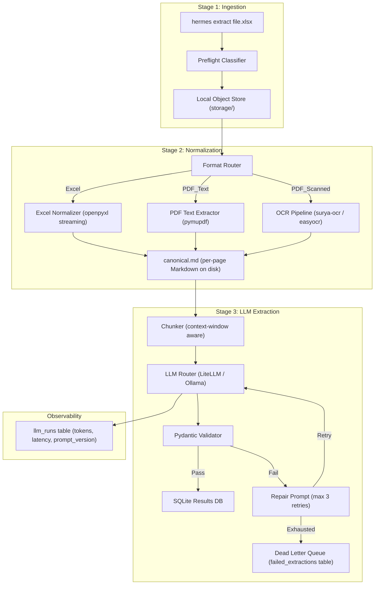

# Hermes: Universal Document Extraction Engine

## Statement of Work -- Full Technical Specification

---

## 1. Project Identity

- **Name:** Hermes
- **Tagline:** "Local-first, memory-safe, LLM-powered document extraction engine."
- **License:** MIT
- **Language:** Python 3.11+
- **Deployment:** CLI-first, SQLite storage, runs entirely offline via Ollama. Cloud LLMs available via LiteLLM configuration.

---

## 2. What Hermes Does (In One Paragraph)

Hermes accepts messy, real-world documents (Excel spreadsheets, text-layer PDFs, scanned/image PDFs) and uses a local or cloud LLM to extract structured data into user-defined Pydantic schemas. It normalizes documents into canonical Markdown (page-by-page, streamed to disk), sends the text to an LLM with strict JSON output contracts, validates the response, retries with repair prompts on failure, and persists the validated output to a SQLite database. Every LLM call is traced for observability (tokens, latency, cost, prompt version). The system never holds an entire document in RAM.

---

## 3. Architecture Overview



---

## 4. Tech Stack

| Layer         | Tool                          | Why                                                         |
| ------------- | ----------------------------- | ----------------------------------------------------------- |
| CLI Framework | `typer` + `rich`          | Proven in QI; beautiful terminal UX                         |
| Validation    | `pydantic` v2               | Strict JSON output contracts, user-defined schemas          |
| LLM (Local)   | Ollama (default)              | Zero cloud dependency, privacy-first                        |
| LLM (Cloud)   | LiteLLM                       | Single interface to OpenAI, Anthropic, Google, etc.         |
| PDF (Text)    | `pymupdf` (fitz)            | Fast, low-memory, page-by-page text extraction              |
| PDF (Scanned) | `surya-ocr`                 | MIT-licensed, local, GPU-optional OCR. Fallback:`easyocr` |
| Excel         | `openpyxl` (read_only mode) | Streams rows without loading entire workbook into RAM       |
| Database      | SQLite (WAL mode)             | Local-first, zero config, proven in QI                      |
| Config        | TOML                          | Same pattern as QI (`~/.hermes/config.toml`)              |
| HTTP Client   | `httpx`                     | For Ollama API calls (same as QI)                           |
| Retry         | `tenacity`                  | Exponential backoff with strict retry budgets               |
| Testing       | `pytest`                    | Standard                                                    |
| Linting       | `ruff`, `mypy`            | Standard                                                    |

---

## 5. Project Structure

```
hermes/
  __init__.py
  __main__.py
  cli.py                    # Typer CLI (extract, status, retry, export)
  config.py                 # Config loading (~/.hermes/config.toml)
  db.py                     # SQLite: jobs, results, llm_runs, failed_extractions
  models.py                 # Core Pydantic models (Job, ExtractionResult, LLMRun)

  ingestion/
    __init__.py
    preflight.py            # File type detection, page count, scanned vs text
    storage.py              # Local object store (storage/ folder) read/write

  normalization/
    __init__.py
    router.py               # Routes to correct normalizer based on preflight
    excel.py                # Excel -> Markdown (openpyxl read_only, per-sheet)
    pdf_text.py             # PDF text layer -> Markdown (pymupdf, per-page)
    pdf_ocr.py              # Scanned PDF -> OCR -> Markdown (surya-ocr, per-page)
    chunker.py              # Splits normalized markdown into LLM-sized chunks

  extraction/
    __init__.py
    llm_client.py           # Unified LLM interface (Ollama direct + LiteLLM)
    prompts.py              # Prompt builder with SHA-256 versioning
    validator.py            # Pydantic validation + repair loop
    pipeline.py             # Orchestrator: normalize -> chunk -> extract -> validate

  schemas/                  # User-defined extraction schemas (examples/)
    __init__.py
    loader.py               # Dynamic Pydantic model loader from Python modules
    examples/
      vehicle_fleet.py      # Example: Mexican Slip de Flotilla vehicle extraction
      generic_table.py      # Example: Generic table row extraction

migrations/
  001_initial.sql

tests/
storage/                    # Local object store (gitignored)

pyproject.toml
config.toml.example
README.md
LICENSE
```

---

## 6. Implementation Stages (Build Order)

### Stage 1: Foundation

**Goal:** CLI skeleton, config, database, and object store.

- `pyproject.toml` with all dependencies.
- `config.py`: Load from `~/.hermes/config.toml`. Defaults for LLM provider (`ollama`), model name (`qwen3:8b`), concurrency, retry budget, storage path.
- `db.py`: SQLite with WAL mode. Tables: `jobs`, `extraction_results`, `llm_runs`, `failed_extractions`. Migration `001_initial.sql`.
- `cli.py`: `hermes extract <file_or_dir>` command stub. `hermes status` to show job states. `hermes retry` to replay DLQ items.
- `ingestion/storage.py`: Simple local file store. `save_raw(file_path) -> storage_uri`, `read_raw(uri) -> Path`. Files stored under `~/.hermes/storage/{job_id}/raw/`.
- `ingestion/preflight.py`: Detect file type (extension + magic bytes). For PDFs: check if text layer exists (pymupdf `page.get_text()` length). Estimate page count. Return a `PreflightResult(file_type, page_count, has_text_layer, estimated_tokens)`.

**Tests:** Config loading, DB init/migration, preflight classification for Excel/PDF-text/PDF-scanned test fixtures.

### Stage 2: Normalization Layer 

**Goal:** Convert any supported document into canonical Markdown on disk.

**Critical Memory Rule:** At no point does the normalizer hold more than ONE page of content in RAM. Every page is written to disk immediately and the buffer is released.

- `normalization/excel.py`:

  - Open workbook with `openpyxl.load_workbook(path, read_only=True, data_only=True)`.
  - Iterate sheets. For each sheet, iterate rows in chunks (e.g., 50 rows).
  - Convert each chunk to a Markdown table string.
  - Append to `{job_id}/normalized/sheet_{n}.md` on disk.
  - Close workbook handle after each sheet.
- `normalization/pdf_text.py`:

  - Open PDF with `pymupdf.open(path)`.
  - Iterate pages. For each page: `page.get_text("text")`.
  - Write to `{job_id}/normalized/page_{n}.md`.
  - Release page object immediately (`del page`).
- `normalization/pdf_ocr.py`:

  - Open PDF with `pymupdf.open(path)`.
  - For each page: render to image (`page.get_pixmap(dpi=150)`).
  - Pass image to `surya-ocr` (or `easyocr`).
  - Write OCR text to `{job_id}/normalized/page_{n}.md`.
  - Delete the pixmap and image buffer immediately.
  - **DPI Strategy:** Start at 150 DPI. If OCR confidence is below threshold, retry that page at 300 DPI. Never go above 300 DPI (memory explodes).
  - **Fallback:** If `surya-ocr` is not installed, fall back to `easyocr`. If neither is available, mark the page as `ocr_unavailable` and skip.
- `normalization/router.py`:

  - Takes a `PreflightResult`.
  - Routes to `excel.py`, `pdf_text.py`, or `pdf_ocr.py`.
  - Returns a list of `NormalizedPage(page_index, markdown_path, source_type, char_count)`.
- `normalization/chunker.py`:

  - Takes the list of `NormalizedPage` paths.
  - Reads each page file from disk (one at a time).
  - Estimates token count (chars / 4 as a rough heuristic, or use `tiktoken` if available).
  - If a single page exceeds the model's context window, splits it into overlapping chunks (e.g., 80% overlap).
  - If multiple small pages fit within the context window, merges them into a single chunk.
  - Returns a list of `Chunk(chunk_index, text, source_pages, estimated_tokens)`.
  - **Context Window Config:** Reads `llm.context_window_tokens` from config (default: 8192 for small Ollama models, 128000 for gpt-4o-mini).

**Tests:** Normalize a small Excel fixture, a text PDF fixture, and a scanned PDF fixture. Verify output Markdown files exist on disk and contain expected content. Test chunker with oversized and undersized pages.

### Stage 3: Schema Loader 

**Goal:** Allow users to define their own Pydantic extraction schemas.

- `schemas/loader.py`:

  - Given a Python module path (e.g., `hermes.schemas.examples.vehicle_fleet`), dynamically import it and find all classes that subclass `pydantic.BaseModel`.
  - The user specifies the schema in `config.toml` or via CLI flag: `hermes extract file.xlsx --schema hermes.schemas.examples.vehicle_fleet:VehicleRecord`.
  - Validate that the schema is a valid Pydantic model with at least one field.
  - Generate a JSON Schema representation (`model.model_json_schema()`) to embed in the LLM prompt.
- `schemas/examples/vehicle_fleet.py`:

  ```python
  class VehicleRecord(BaseModel):
      marca: str | None = None
      descripcion: str | None = None
      modelo: int | None = None
      numero_serie: str | None = None
      tipo_vehiculo: str | None = None
      cobertura: str | None = None
      suma_asegurada: float | None = None
      deducible: str | None = None
  ```
- `schemas/examples/generic_table.py`:

  ```python
  class GenericRow(BaseModel):
      row_data: dict[str, Any]
  ```

**Tests:** Load a schema dynamically. Verify JSON schema generation. Test with a schema that has no fields (should raise error).

### Stage 4: LLM Extraction Pipeline

**Goal:** Send normalized chunks to the LLM, validate the output, handle failures.

- `extraction/llm_client.py`:

  - **Ollama Mode (Default):** Direct HTTP calls to `http://localhost:11434` via `httpx` (same pattern as QI's `OllamaClient`). Supports `generate` endpoint with `format: "json"`.
  - **LiteLLM Mode:** When `llm.provider = "litellm"` in config, use `litellm.completion()`. This gives access to OpenAI, Anthropic, Google, etc., with a single interface.
  - **Unified Interface:** Both modes return an `LLMResponse(content: str, model: str, tokens_in: int, tokens_out: int, latency_ms: int, raw_response: dict)`.
  - **Timeout:** Configurable. Default 120s for Ollama (local models are slow), 30s for cloud.
  - **Readiness Check:** `client.check_ready()` pings the LLM provider before starting a batch.
- `extraction/prompts.py`:

  - **System Prompt:** "You are a document data extractor. Given raw text from a document, extract all records that match the provided JSON schema. Return a JSON array of objects. Do not invent data not present in the text. If a field cannot be determined, use null."
  - **User Prompt:** Contains: (1) the JSON Schema of the target Pydantic model, (2) the chunk text, (3) instructions to return a JSON array.
  - **Prompt Versioning:** SHA-256 hash of the system + user prompt template (same pattern as QI).
- `extraction/validator.py`:

  - Parse the raw LLM output string.
  - Strip markdown code fences if present (` ```json ... ``` `).
  - Parse as JSON array.
  - Validate each element against the user-defined Pydantic schema.
  - Return `list[ValidatedRecord]` for records that pass, `list[FailedRecord]` for those that don't.
  - **Repair Loop:** If validation fails, build a repair prompt: "The following JSON did not match the schema. Error: {error}. Fix it and return valid JSON only." Retry up to `llm.max_retries` times (default: 2).
- `extraction/pipeline.py`:

  - **The Orchestrator.** This is the main function called by the CLI.
  - Flow:
    1. Run preflight on the input file.
    2. Save raw file to object store.
    3. Create a `job` record in the DB (status: `normalizing`).
    4. Run the appropriate normalizer (Excel/PDF-text/PDF-OCR).
    5. Run the chunker on the normalized pages.
    6. Update job status to `extracting`.
    7. For each chunk: call the LLM, validate, persist results.
    8. If all chunks succeed: update job status to `completed`.
    9. If any chunk exhausts retries: update job status to `partial` or `failed`, persist the failure to `failed_extractions`.
  - **Concurrency:** For the CLI-first MVP, process chunks sequentially (one at a time). This is the safest memory profile. Add `asyncio` concurrency later as an opt-in (`--concurrent N`).
  - **Progress:** Use `rich.progress` to show a progress bar (chunks processed / total chunks).

**Tests:**

- Mock the LLM client. Test happy path (valid JSON returned).
- Test repair loop (first call returns broken JSON, second call returns valid JSON).
- Test exhausted retries (3 failures -> DLQ).
- Test prompt versioning stability.
- Test with the `vehicle_fleet.py` example schema.

### Stage 5: CLI Polish & Observability 

**Goal:** Production-quality CLI, full observability, DLQ replay.

- `cli.py` commands:

  - `hermes extract <file_or_dir> --schema <module:Class>` -- Run the full pipeline.
  - `hermes extract <dir> --schema <module:Class>` -- Process all supported files in a directory.
  - `hermes status` -- Show all jobs (id, file, status, records extracted, errors).
  - `hermes status <job_id>` -- Show detailed job info including per-chunk results.
  - `hermes retry [job_id]` -- Replay failed chunks from the DLQ. Optionally with a different `--schema` or `--model`.
  - `hermes export <job_id> --format jsonl` -- Export extracted records as JSONL.
  - `hermes export <job_id> --format csv` -- Export as CSV.
  - `hermes init` -- Create `~/.hermes/`, default config, example schemas.
  - `hermes version` -- Show version.
- `db.py` observability:

  - `llm_runs` table: `job_id, chunk_index, model, prompt_version, tokens_in, tokens_out, total_latency_ms, validation_passed, validation_error, raw_output, created_at`.
  - `failed_extractions` table: `job_id, chunk_index, chunk_text_uri, last_error, retry_count, status (pending/replayed/abandoned), created_at`.

### Stage 6: Testing & Documentation

**Goal:** Comprehensive tests, README, example walkthrough.

- **Test fixtures:** Include 2-3 small Excel files and 1-2 small PDFs (public domain or synthetic) in `tests/fixtures/`.
- **Integration test:** Full pipeline end-to-end with mocked LLM.
- **README:** Installation, Quick Start, Configuration, Custom Schemas, Architecture Decisions section (like QI).

---

## 7. Memory Safety Strategies (The GPT-5.2 Remediations)

| Bottleneck                      | Remediation                                              | Implementation                                                                  |
| ------------------------------- | -------------------------------------------------------- | ------------------------------------------------------------------------------- |
| Full file in RAM                | Stream to disk on ingest                                 | `ingestion/storage.py` copies file via `shutil.copyfileobj` with 8KB buffer |
| PDF page rasterization          | One page at a time, delete pixmap immediately            | `normalization/pdf_ocr.py` uses `del pixmap` after each page                |
| Excel full workbook load        | `read_only=True` mode in openpyxl                      | `normalization/excel.py` iterates rows lazily                                 |
| Unbounded concurrency           | Sequential by default, semaphore for opt-in concurrency  | `extraction/pipeline.py` processes one chunk at a time                        |
| Retry storms                    | Strict retry budget per chunk (max 2 retries)            | `extraction/validator.py` uses `tenacity.stop_after_attempt(3)`             |
| Batch accumulation              | Persist each result immediately after validation         | `extraction/pipeline.py` calls `save_result()` per chunk, not at end        |
| String concatenation in prompts | Build prompts via f-strings with pre-computed components | `extraction/prompts.py` builds prompt once per chunk                          |
| Holding bytes + base64 + text   | Workers pass URIs (file paths), never raw bytes          | All inter-stage communication is via `Path` objects                           |
| Long-lived process memory leaks | Config reload cache with `lru_cache` (same as QI)      | `config.py` uses `@functools.lru_cache()`                                   |

---

## 8. LLM Configuration

Default `~/.hermes/config.toml`:

```toml
[llm]
provider = "ollama"             # "ollama" or "litellm"
model = "qwen3:8b"              # Ollama model name
base_url = "http://localhost:11434"
temperature = 0.1               # Low temp for extraction (deterministic)
context_window_tokens = 8192    # Model's context window
max_retries = 2                 # Repair loop retries per chunk
timeout_seconds = 120           # Per-call timeout

[llm.litellm]
model = "gpt-4o-mini"           # LiteLLM model string
api_key_env = "OPENAI_API_KEY"  # Env var name for the API key
temperature = 0.0
context_window_tokens = 128000
max_retries = 2
timeout_seconds = 30

[normalization]
ocr_engine = "surya"            # "surya", "easyocr", or "none"
ocr_dpi = 150                   # Starting DPI for OCR
ocr_max_dpi = 300               # Max DPI on retry
ocr_confidence_threshold = 0.7  # Re-OCR at higher DPI if below this

[storage]
base_path = "~/.hermes/storage"

[extraction]
default_schema = "hermes.schemas.examples.generic_table:GenericRow"
chunk_overlap_ratio = 0.1       # 10% overlap between chunks
```

**Switching between Ollama and Cloud:**
The user simply changes `llm.provider` from `"ollama"` to `"litellm"` and sets the appropriate env var. No code changes needed. The `llm_client.py` factory function reads the config and returns the correct client.

---

## 9. Database Schema (001_initial.sql)

```sql
CREATE TABLE IF NOT EXISTS jobs (
    id INTEGER PRIMARY KEY,
    file_name TEXT NOT NULL,
    file_type TEXT NOT NULL,
    page_count INTEGER,
    has_text_layer INTEGER,
    schema_class TEXT NOT NULL,
    status TEXT NOT NULL DEFAULT 'queued',
    total_chunks INTEGER DEFAULT 0,
    completed_chunks INTEGER DEFAULT 0,
    failed_chunks INTEGER DEFAULT 0,
    created_at TIMESTAMP DEFAULT CURRENT_TIMESTAMP,
    completed_at TIMESTAMP
);

CREATE TABLE IF NOT EXISTS extraction_results (
    id INTEGER PRIMARY KEY,
    job_id INTEGER NOT NULL REFERENCES jobs(id),
    chunk_index INTEGER NOT NULL,
    source_pages TEXT,
    record_json TEXT NOT NULL,
    model TEXT,
    prompt_version TEXT,
    created_at TIMESTAMP DEFAULT CURRENT_TIMESTAMP
);

CREATE TABLE IF NOT EXISTS llm_runs (
    id INTEGER PRIMARY KEY,
    job_id INTEGER NOT NULL REFERENCES jobs(id),
    chunk_index INTEGER NOT NULL,
    run_type TEXT NOT NULL DEFAULT 'extraction',
    model TEXT,
    prompt_version TEXT,
    tokens_in INTEGER,
    tokens_out INTEGER,
    total_latency_ms INTEGER,
    validation_passed INTEGER,
    validation_error TEXT,
    raw_output TEXT,
    created_at TIMESTAMP DEFAULT CURRENT_TIMESTAMP
);

CREATE TABLE IF NOT EXISTS failed_extractions (
    id INTEGER PRIMARY KEY,
    job_id INTEGER NOT NULL REFERENCES jobs(id),
    chunk_index INTEGER NOT NULL,
    chunk_text_uri TEXT,
    last_error TEXT,
    retry_count INTEGER DEFAULT 0,
    status TEXT NOT NULL DEFAULT 'pending',
    created_at TIMESTAMP DEFAULT CURRENT_TIMESTAMP
);

CREATE TABLE IF NOT EXISTS schema_version (
    version INTEGER PRIMARY KEY,
    applied_at TIMESTAMP DEFAULT CURRENT_TIMESTAMP
);

INSERT OR IGNORE INTO schema_version (version) VALUES (1);
```

---

## 10. Risk Register

| Risk                                                    | Likelihood | Impact | Mitigation                                                                                                                                                      |
| ------------------------------------------------------- | ---------- | ------ | --------------------------------------------------------------------------------------------------------------------------------------------------------------- |
| Ollama model too small for complex tables               | High       | Medium | Default to `qwen3:8b` but document that `qwen3:30b` or cloud models perform better on complex layouts. Chunker ensures each chunk is within context window. |
| surya-ocr not available on all platforms                | Medium     | Low    | Fallback chain: surya -> easyocr -> skip with warning. OCR is optional; many underwriting docs are text-layer PDFs.                                             |
| LLM returns partial/malformed JSON                      | High       | Medium | Repair loop with error feedback. Strip markdown fences. Strict Pydantic validation. DLQ for unrecoverable failures.                                             |
| User-defined schema has fields the LLM cannot extract   | Medium     | Low    | Return `null` for unfilled fields. The prompt explicitly instructs "use null if not determinable."                                                            |
| Large scanned PDFs (100+ pages) exhaust local resources | Medium     | High   | Page-by-page processing with immediate cleanup. Progress bar shows per-page progress. User can limit page range via `--pages 1-10`.                           |
